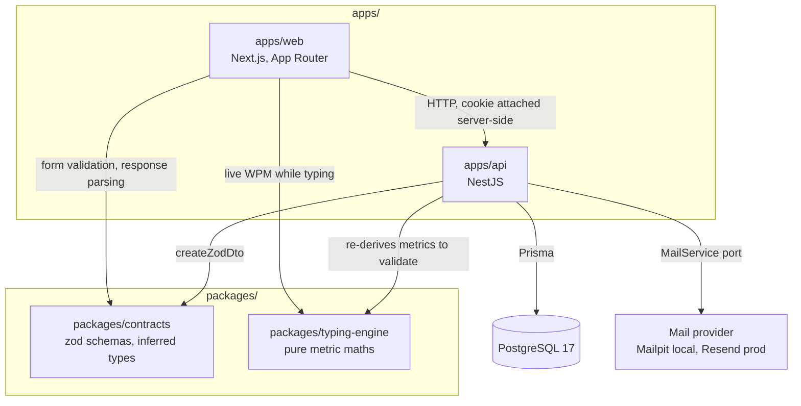
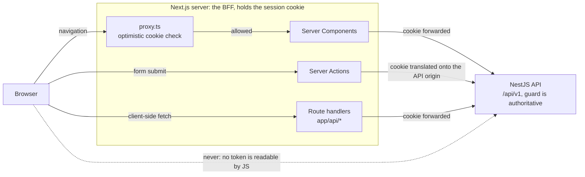
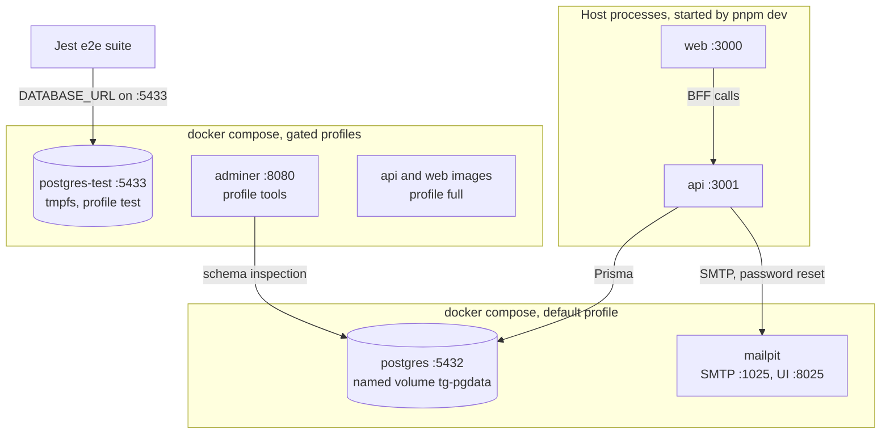
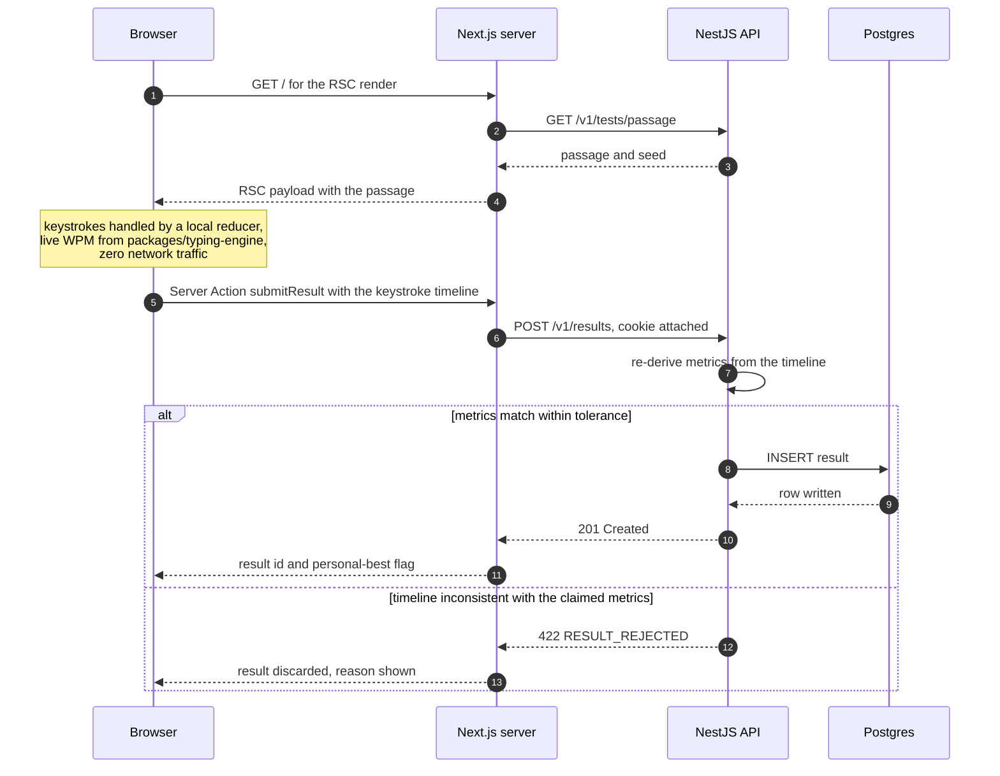

# Architecture

> Status: **Proposed** — no application code exists yet. This document is the authoritative
> target architecture. Changes to it require a spec update first (see [spec/README.md](spec/README.md)).

## 1. Product context

`typing-game` is a typing-speed application: a user types a generated text passage against a
timer, and the system records WPM (words per minute), raw WPM, accuracy, consistency and a
keystroke-level history. Results are persisted per user and aggregated into personal bests and
leaderboards.

Two consequences drive the architecture:

1. **The typing loop is latency-critical and fully client-side.** Keystroke handling, caret
   movement and per-character diffing must never round-trip to the server. The typing engine is
   a client-only React component holding its own state; the server only receives the *finished*
   result for validation and persistence.
2. **Results are untrusted input.** A client can post any WPM. The backend must re-derive
   metrics from the submitted keystroke timeline and reject inconsistent submissions
   (see [spec/features/001-authentication-and-users.md](spec/features/001-authentication-and-users.md#anti-cheat-touchpoints)).

## 2. Repository layout

Monorepo, pnpm workspaces + Turborepo.

```
typing-game/
├── apps/
│   ├── api/                    # NestJS 11 — HTTP API, business logic, persistence
│   │   ├── prisma/
│   │   │   ├── schema.prisma
│   │   │   ├── migrations/
│   │   │   └── seed.ts
│   │   ├── src/
│   │   │   ├── main.ts
│   │   │   ├── app.module.ts
│   │   │   ├── config/         # @nestjs/config + zod env validation
│   │   │   ├── common/         # guards, interceptors, filters, decorators
│   │   │   ├── prisma/         # PrismaModule + PrismaService (onModuleInit connect)
│   │   │   └── modules/
│   │   │       ├── auth/       # login, register, refresh rotation, password reset, guards
│   │   │       ├── mail/       # MailService port + smtp | resend | memory drivers
│   │   │       ├── users/      # profile, settings, account lifecycle
│   │   │       ├── tests/      # passage generation, test session lifecycle
│   │   │       ├── results/    # result submission, validation, personal bests
│   │   │       └── leaderboard/
│   │   └── test/               # Jest e2e (Supertest) against a throwaway Postgres
│   └── web/                    # Next.js 16 — App Router
│       ├── src/
│       │   ├── app/
│       │   │   ├── (marketing)/          # public: landing, about
│       │   │   ├── (game)/               # the typing surface
│       │   │   ├── (auth)/                # login, register, forgot/reset password
│       │   │   ├── (account)/            # profile, security, settings, danger — auth required
│       │   │   ├── api/                  # BFF route handlers only (see §4)
│       │   │   └── layout.tsx
│       │   ├── components/               # shared, presentational
│       │   ├── features/                 # feature-scoped UI + hooks + tests, co-located
│       │   ├── lib/                      # server-only fetchers, session helpers
│       │   └── proxy.ts                  # Next 16 proxy (formerly middleware.ts)
│       └── vitest.config.ts
├── packages/
│   ├── contracts/              # zod schemas + inferred types shared by api & web
│   ├── typing-engine/          # framework-agnostic metric computation (pure, 100% unit tested)
│   ├── eslint-config/
│   └── tsconfig/
├── docker/
│   ├── docker-compose.yml      # postgres (+ adminer, profile-gated)
│   ├── api.Dockerfile          # multi-stage
│   └── web.Dockerfile          # multi-stage
├── spec/
│   ├── README.md
│   └── features/
├── ARCHITECTURE.md
├── CHANGELOG.md
├── turbo.json
├── pnpm-workspace.yaml
└── .env.example
```

### Dependency graph



Dependencies point one way only: apps depend on packages, never the reverse, and `packages/*` never
depend on each other. `packages/contracts` and `packages/typing-engine` are the only code both apps
share, and that is deliberate — they are exactly the two things that must not drift.

### Why `packages/typing-engine`

WPM/accuracy/consistency must be computed identically on the client (live display) and on the
server (validation). Duplicating that maths guarantees drift, and drift here means false-positive
cheat rejections. One pure package, imported by both, is the only safe arrangement.

### Why `packages/contracts`

Zod schemas are the single source of truth for payload shape, and the only place a request or
response shape is declared. The API derives its DTOs from them (`nestjs-zod` → `createZodDto`); the
web app imports the same schemas for form validation and for parsing responses, and imports the
inferred types (`z.infer<typeof loginSchema>`) rather than re-declaring interfaces.

Rules that make this hold:

- A DTO or response type declared outside `packages/contracts` is a review rejection. That includes
  a hand-written `interface User` in the web app.
- Types are **inferred**, never written alongside the schema. `z.infer` cannot drift from its
  schema; a hand-written twin can.
- The package has no runtime dependency beyond `zod` — importing it must never pull Nest or React
  into the other side's bundle.

> **Confirmed 2026-09-10.** zod + `nestjs-zod` is the project's validation layer, deliberately
> overriding the "DTOs with class-validator decorators" default. The reason is drift: a shape
> declared twice diverges, and the halves that diverge are the web form and the API that rejects it.
> One schema, imported by both, is the point. Consequence to accept: OpenAPI generation goes through
> `nestjs-zod`'s `zodToOpenAPI` rather than `@nestjs/swagger`'s decorator scanning.

## 3. Backend architecture (NestJS)

- **One module per domain.** `AuthModule`, `UsersModule`, `TestsModule`, `ResultsModule`,
  `LeaderboardModule`, plus `MailModule` — a thin infrastructure module exposing a `MailService` port
  with swappable drivers (SMTP/Mailpit locally, Resend in production, in-memory in tests), required
  by password reset. A module exposes a service; cross-module access goes through the exported
  service, never through another module's repository.
- **Controllers route, services decide.** Controllers do: bind route, validate payload via DTO,
  call one service method, map to a response DTO. No conditionals with business meaning.
- **Guards for auth, interceptors for cross-cutting concerns.** `JwtAuthGuard` is registered
  globally via `APP_GUARD` with an opt-out `@Public()` decorator, so a new endpoint is protected
  by default — forgetting a decorator fails closed. A `ClassSerializerInterceptor` strips
  `passwordHash` and similar fields at the boundary.
- **Validation.** Global `ValidationPipe` with `whitelist: true`, `forbidNonWhitelisted: true`,
  `transform: true`. Unknown fields are a 400, not silently dropped.
- **Errors.** A global `HttpExceptionFilter` emits the single error envelope defined in
  [spec/README.md](spec/README.md#error-envelope). Prisma errors are translated in the
  persistence layer (`P2002` → `ConflictException`); Prisma error codes never leak upward.
- **Config.** `@nestjs/config` with `validate:` backed by a zod schema. The app refuses to boot on
  a missing or malformed env var — no `process.env.X!` at call sites.
- **Rate limiting.** `@nestjs/throttler` globally, with tighter per-route limits on
  `POST /auth/login`, `POST /auth/register` and `POST /results`.

### Layering inside a module

```
controller  →  service  →  prisma (via PrismaService)
   DTO in       domain      persistence
   DTO out      logic
```

No repository abstraction over Prisma. Prisma's client is already the repository; wrapping it adds
indirection without a second implementation to justify it. If a second datastore appears, that is
the moment to introduce the port.

## 4. Frontend architecture (Next.js App Router)

**Server Components by default.** `"use client"` is opt-in and confined to leaves that need
interactivity — the typing surface, settings toggles, charts.

| Concern | Where it lives |
| --- | --- |
| Page shell, static copy, SEO metadata | Server Component |
| Authenticated data read on first paint (profile, history, leaderboard) | Server Component, `fetch` to the API with the cookie forwarded |
| Live typing loop, caret, per-key state | Client Component (`features/typing/`) |
| Client-side data (paginated history, live leaderboard polling) | `@tanstack/react-query` in a Client Component |
| Mutations that must set cookies (login, logout, register) | Server Actions → Next.js sets the httpOnly cookie |
| Result submission after a test | Server Action (keeps the access token out of the browser) |

### The BFF boundary

The browser never talks to NestJS directly. All calls go through the Next.js server (Server
Components, Server Actions, or `app/api/*` route handlers), which holds the session cookie and
attaches credentials. Rationale:

- Tokens stay in `httpOnly` cookies scoped to the web origin; no token is readable by JS, so an
  XSS foothold cannot exfiltrate a session.
- No CORS surface, and no third-party-cookie exposure in cross-site contexts.
- The API can stay on a private network in production.

Cost: one extra hop, and Server Actions are serialized per-session — acceptable for everything
except the typing loop, which does not touch the network at all.



### Route protection

`src/proxy.ts` (Next 16 renamed `middleware.ts` → `proxy.ts`) performs an **optimistic** check:
cookie present and structurally valid → allow; absent → redirect to `/login`. It does not hit the
database or the API, because it runs on every prefetch. The authoritative check is the NestJS
guard on each endpoint, plus a `requireSession()` call in protected Server Components.

### State management

No global client state library. In order of preference:

1. Server Component props (server-owned data).
2. URL search params (filters, pagination, selected mode) — shareable and back-button correct.
3. `useState`/`useReducer` inside the feature (the typing engine is a `useReducer` over keystroke
   events).
4. React Query cache (server data fetched client-side).
5. A small `zustand` store **only** for cross-tree UI preferences (theme, sound, caret style)
   that also persist to `localStorage`.

### Styling

Tailwind CSS v4 (CSS-first config, `@theme` in `globals.css`). Design tokens — mono font stack,
caret colours, correct/incorrect/pending character states — are declared as theme variables so the
typing surface and the charts stay consistent. No CSS-in-JS.

## 5. Docker & local development

`docker/docker-compose.yml` runs **infrastructure only** in the default profile: Postgres 17 with a
named volume, a healthcheck and a host port, plus Mailpit as a local mail catcher so password reset
works from a clean clone. `api` and `web` run on the host via
`pnpm dev` (Turborepo) — HMR through a bind mount is slower and flakier on macOS than running the
Node processes natively.

Profiles:

| Profile | Services | Use |
| --- | --- | --- |
| *(default)* | `postgres`, `mailpit` | day-to-day development |
| `tools` | `+ adminer` | schema inspection |
| `full` | `+ api`, `+ web` | verifying the production images end-to-end |
| `test` | `postgres-test` (tmpfs, separate port) | e2e suite, wiped per run |



Both Dockerfiles are multi-stage (`deps` → `build` → `runner`), run as a non-root user, and copy
only the pruned workspace output (`turbo prune`). No secret is baked into an image; runtime config
arrives as env vars. Full detail in
[spec/features/002-database-and-docker.md](spec/features/002-database-and-docker.md).

## 6. Testing strategy

| Layer | Tool | Scope |
| --- | --- | --- |
| `packages/typing-engine` | Jest | Pure unit tests over metric maths; table-driven, includes adversarial keystroke timelines |
| API unit | Jest | Services with mocked `PrismaService` |
| API integration/e2e | Jest + Supertest | Real Nest app + real Postgres (`test` profile), migrated and truncated per suite. Contract-level: status codes, error envelope, cookie flags |
| Web unit/component | Vitest + React Testing Library | Client Components, hooks, the typing surface driven by `userEvent.keyboard` |
| Web server-side | Vitest | Server Action and fetcher logic with the API mocked via MSW |
| Mail | Jest | The `memory` driver records sends; the e2e suite asserts reset URLs without opening SMTP |

TDD is mandatory per the development cycle: tests derived from the spec contract are written and
**human-approved** before implementation. Coverage thresholds are enforced in CI on
`packages/typing-engine` (100% statements/branches) and `apps/api/src/modules/**` (85%).

## 7. Cross-cutting decisions

- **Logging:** `nestjs-pino` on the API, structured JSON, request-id correlation. `console.log` is
  an ESLint error in both apps.
- **API versioning:** URI versioning, all routes under `/v1`. Global prefix `api` on the Nest app,
  so the effective path is `/api/v1/...`.
- **Time:** all timestamps stored as `timestamptz` in UTC; formatting is the frontend's job.
- **IDs:** `cuid2` primary keys — sortable-ish, URL-safe, non-enumerable. Sequential integers would
  leak user and result counts through the leaderboard URLs.
- **Migrations:** `prisma migrate` only. Schema drift is detected in CI via
  `prisma migrate diff --exit-code`.

## 8. Sequence: a completed typing test



The latency-critical part of the product is the one part with no server in it. That is the whole
point of the arrangement: the network appears only after the test is over.

## 9. Open decisions for review

**All five decisions were confirmed on 2026-09-10** (see
[spec 002 § 10](spec/features/002-database-and-docker.md#10-decision-log) and
[spec 001 § 10](spec/features/001-authentication-and-users.md#10-decision-log)). Nothing in this
section blocks implementation. They are kept here, with their trade-offs, so the reasoning survives
the decision.

| # | Decision | Chosen | Alternative | Trade-off |
| --- | --- | --- | --- | --- |
| 1 | ORM — **confirmed** | Prisma | Drizzle | Prisma: best-in-class migrations, generated types, mature NestJS integration; heavier runtime, less SQL control. Drizzle: thin, SQL-first, faster cold start; migration tooling and relational query ergonomics are weaker for a team |
| 2 | DTO validation — **confirmed** | zod in `packages/contracts` + `nestjs-zod` | `class-validator` DTOs per the global convention | zod: one schema shared by web forms and API validation, no drift. class-validator: idiomatic NestJS, better Swagger integration out of the box, but the shape is then declared twice |
| 3 | Monorepo tool — **confirmed** | pnpm workspaces + Turborepo | pnpm workspaces alone, or Nx | Turborepo: cheap to adopt, good caching. Nx: more power, more config. Plain pnpm: no task graph or caching |
| 4 | Token transport — **confirmed** | httpOnly cookies via the Next.js BFF | Bearer tokens held in the browser | BFF: XSS cannot read the token, no CORS; costs a hop and makes the web app stateful about sessions. Bearer: simpler, directly consumable by a future mobile client — the API supports both (§ spec 001) so this is a default, not a lock-in |
| 5 | Guest play — **confirmed** | Anonymous results allowed, claimable on signup (guest cookie 90 days) | Auth required to play | Guest play is the conversion funnel for a typing game, but it needs an anonymous-session mechanism and a claim flow |
