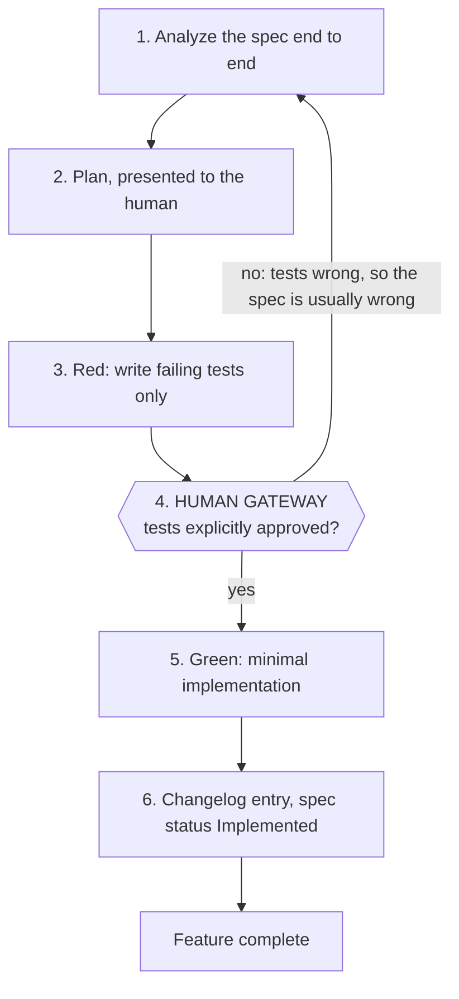

# Specifications

This project is built with **Spec-Driven Development (SDD)**. A specification is written and
reviewed *before* any application code exists. The spec is the contract; the code is an
implementation detail of it.

If code and spec disagree, the spec is not "out of date" — one of the two is a bug, and the fix
starts by deciding which.

## Directory conventions

```
spec/
├── README.md                 # this file — conventions, envelopes, the cycle
└── features/
    └── NNN-kebab-case-name.md
```

- `NNN` is a zero-padded, monotonically increasing sequence number. Numbers are never reused and
  never reordered, so a spec can be referenced as "spec 001" in commits, tests and PRs.
- One feature per file. If a file grows past roughly 600 lines, that is a signal the feature is
  two features — unless the spec records why it stays whole (as
  [001](features/001-authentication-and-users.md#1-summary) does: every auth flow mutates the same
  session model, so splitting them would spread one state machine across four documents).
- Cross-reference other specs by relative link, e.g.
  `[spec 002](002-database-and-docker.md#migrations)`.

## Spec statuses

Every spec carries a status in its front matter:

| Status | Meaning |
| --- | --- |
| `Draft` | Being written. Do not implement against it. |
| `Approved` | Human-reviewed. Implementation may begin. |
| `Implemented` | Code exists and satisfies the spec; tests reference its acceptance criteria. |
| `Superseded` | Replaced. Must link forward to the spec that replaced it. |

A spec is never deleted. Superseding is an append-only operation, so the reasoning behind past
decisions stays readable.

## Required sections

Every file in `features/` must contain these sections, in this order:

1. **Front matter** — `Spec`, `Status`, `Owner`, `Last updated`, `Depends on`.
2. **1. Summary** — two or three sentences. What this feature is, and why it exists.
3. **2. Scope** — an explicit *In scope* / *Out of scope* pair. Out of scope is the more
   important half: it is what stops implementation from sprawling.
4. **3. User stories** — `As a … I want … so that …`, each with numbered acceptance criteria that
   a test can assert against.
5. **4. Data model** — schema definitions as real code (Prisma schema blocks), including indexes,
   constraints, cascade behaviour, and the reason for each non-obvious index. Must carry an
   `erDiagram` (see § Diagrams).
6. **5. API contracts** — per endpoint: method, path, auth requirement, request schema, request
   example, success status and response example, and the complete list of error responses. Any flow
   spanning more than one request needs a `sequenceDiagram`; any resource with a lifecycle needs a
   `stateDiagram-v2`.
7. **6. Frontend pages & routes** — for every feature with a UI: the route map (path, route group,
   auth requirement, RSC vs. client), the layouts, and per page its data source, client components,
   Server Actions, error-to-UI mapping, loading/empty/error states, and accessibility obligations.
   A backend-only feature keeps the section and states *"Not applicable"*, so section numbers stay
   identical across specs and cross-references remain predictable. Must carry a `flowchart` of the
   route map and one of the redirect rules.
8. **7. Edge cases & error handling** — a table of condition → expected behaviour. Concurrency,
   idempotency, boundary values, and abuse cases belong here.
9. **8. Non-functional requirements** — performance budgets, rate limits, security constraints, and
   known limitations accepted for this version.
10. **9. Test plan** — the suites to write, keyed to the acceptance criteria above. This section
    is what step 3 of the development cycle is executed from.
11. **10. Decision log** — every question that was open and has since been answered, with the
    resolution and its reasoning. Append-only: a resolved question is moved here, never deleted, so
    the reason behind a constraint stays discoverable at the point where the constraint lives.
12. **11. Open questions** — anything the author could not decide alone. An empty list is a valid
    answer; a missing section is not.

A spec that cannot state its acceptance criteria as assertable statements is not finished.

**Why § 6 is mandatory.** An API contract without its pages leaves the interesting half of the work
unspecified: which errors a user actually sees, what the page does while a request is in flight, and
what is rendered when there is no data. Those are the decisions that get improvised at 5pm otherwise.

## Writing rules

- **Actionable for both humans and coding agents.** Concrete values, not adjectives: "access
  token TTL 15 minutes", not "short-lived". "Passage of 25/50/100 words", not "configurable
  length".
- **Contracts are literal.** Real JSON payloads, real status codes, real header names. If the
  reader has to guess the field name, the spec has failed.
- **State the failure mode.** Every input that can be wrong gets an expected error response.
- **Record the trade-off.** When a choice was between two viable options, write down what was
  given up. That is what makes the decision reviewable a year later.
- **No implementation code.** Schemas, contracts and examples, yes. Service bodies, no.
- **Draw the shape, write the contract.** Anything with more than two moving parts gets a diagram
  (§ Diagrams). Prose carries the guarantees; the diagram carries the shape.

## Diagrams

**Every feature spec and `ARCHITECTURE.md` must contain at least one Mermaid diagram, and every
diagram must parse.** A diagram that does not render is worse than no diagram: it is a blank space
where the reader expected the explanation, and it fails silently in most Markdown viewers.

### Required diagrams

| Document | Section | Diagram | Must show |
| --- | --- | --- | --- |
| Feature spec | 4. Data model | `erDiagram` | Every model the spec introduces, its keys (`PK`/`FK`/`UK`), and relationship cardinality |
| Feature spec | 5. API contracts | `sequenceDiagram` | Each flow spanning more than one request, including the failure branch |
| Feature spec | 5. API contracts | `stateDiagram-v2` | Each resource with a lifecycle (a session, a token, a submission) |
| Feature spec | 6. Frontend pages | `flowchart` | The route map with the navigation between pages, and the redirect/guard rules |
| `ARCHITECTURE.md` | Layout & backend | `flowchart` | Module and package dependencies, with the direction of every dependency |
| `ARCHITECTURE.md` | Frontend | `flowchart` | The request path and where the trust boundary sits |
| `ARCHITECTURE.md` | Per critical path | `sequenceDiagram` | The end-to-end path of the feature the product exists for |

A backend-only spec has no § 6 diagram; every other row applies to every spec.

### Validity is enforced, not assumed

- Only fenced ` ```mermaid ` blocks. No committed SVG or PNG, no PlantUML, no external rendering
  service — a diagram must be reviewable as a diff and renderable offline.
- `pnpm docs:diagrams` extracts every fenced Mermaid block in the repository and runs
  `mermaid.parse()` over it. **CI fails on a parse error**, and the job runs on any PR touching a
  `.md` file.
- Locally, validate with the `validate-diagrams` skill before committing. Do not commit a diagram
  you have not rendered or parsed — Mermaid's failure mode is a silent empty block, so "it looks
  right" is not evidence.

### Style rules

These exist because each one is a parser error or a rendering bug we would otherwise hit repeatedly:

- **Quote every label**: `A["POST /auth/login"]`, not `A[POST /auth/login]`. Unquoted `/`, `(`, `:`
  and `-` inside a label are the single most common breakage.
- **Label every edge.** An unlabelled arrow between two boxes asserts a relationship without saying
  what it is.
- **No colours, no `%%{init}%%` theme blocks.** Diagrams render in both light and dark; anything
  hardcoded is unreadable in one of them. Meaning is carried by shape, direction and label.
- **≤ 20 nodes.** Past that, split into two diagrams with a stated boundary. A diagram nobody can
  follow is decoration.
- **Stable node ids** (`API`, `PG`, `SESSION`), so a later edit produces a readable diff instead of
  a renumbered wall.
- **ASCII is allowed for exactly one thing: UI wireframes**, in a plain code block. Mermaid has no
  wireframe primitive, and a box-drawn login form communicates more than a flowchart of it. Every
  other diagram — flow, sequence, state, entity — is Mermaid.

### Diagrams never replace prose

The contract is the table; the diagram is the shape. A status code, a field rule or an error `code`
that appears only in a diagram does not exist — tests are written from § 5 and § 9, and neither is
generated from a picture.

## Shared conventions

### Base path & versioning

All endpoints are served under `/api/v1`. Paths in specs are written relative to that prefix:
`POST /auth/login` means `POST /api/v1/auth/login`.

### Error envelope

Every non-2xx response from the API uses exactly this shape:

```json
{
  "error": {
    "code": "VALIDATION_FAILED",
    "message": "Request payload is invalid.",
    "details": [
      { "path": "email", "message": "Must be a valid email address." }
    ],
    "requestId": "01JC8Z4K2R6XQ9V3T5N7M1B0AF"
  }
}
```

- `code` — stable `SCREAMING_SNAKE_CASE` identifier. Clients branch on this, never on `message`.
- `message` — human-readable, safe to display, never leaks internals or stack traces.
- `details` — present only for field-level validation failures.
- `requestId` — correlates with the API log line for that request.

Specs list error cases by `code`. A new `code` is part of the API surface and must appear in a
spec before it appears in code.

### Pagination

Cursor-based, for every list endpoint:

```
GET /results?limit=20&cursor=<opaque>
```

```json
{
  "data": [],
  "pageInfo": { "nextCursor": "<opaque>|null", "hasNextPage": false }
}
```

`limit` defaults to 20, maximum 100. Offset pagination is not used: leaderboards and result
history are append-heavy, where offsets skip and duplicate rows.

### Payload schemas

Every request and response shape in a spec's § 5 has exactly one executable counterpart: a zod
schema in `packages/contracts`, imported by both the API (via `nestjs-zod`'s `createZodDto`) and the
web app (form validation and response parsing). Types are inferred from those schemas with
`z.infer`, never hand-written next to them.

So a spec's field-rule table is not decoration — it is the source the schema is written from, and
the schema is the source both sides validate against. If a rule in a spec has no line in a schema,
one of the two is wrong.

### Identifiers

`cuid2` strings for all primary keys, exposed as-is in the API. No sequential integers in URLs.

### Timestamps

`timestamptz`, UTC, ISO-8601 with `Z` in JSON (`2026-09-10T14:32:05.123Z`). The API never returns
a localised or formatted date.

## The development cycle

This cycle is mandatory for every feature. Step 4 is a hard stop.

| # | Step | Output |
| --- | --- | --- |
| 1 | **Analyze** | Read `spec/features/NNN-*.md` end to end. Raise contradictions before writing anything. |
| 2 | **Plan** | An implementation strategy presented to the human: files to create, order of work, risks. |
| 3 | **Red** | Failing tests derived from § 5 (contracts) and § 9 (test plan) of the spec. Tests only — no implementation. |
| 4 | **🛑 Human gateway** | The human reviews and explicitly approves the tests. **No feature code is written before that approval.** If the tests are wrong, the spec is usually wrong — go back to step 1. |
| 5 | **Green** | The minimal clean implementation that makes the approved tests pass. No extra features, no speculative abstraction. |
| 6 | **Changelog** | An entry under `[Unreleased]` in `CHANGELOG.md`, and the spec's status moved to `Implemented`. |



### Why the gateway exists

Tests written from a spec encode an interpretation of that spec. If the interpretation is wrong
and code is written first, the tests get bent to fit the code and the spec silently loses. Freezing
the tests under human review first makes the interpretation the thing under scrutiny — while it is
still cheap to change.

## Spec index

| Spec | Title | Status | Notes |
| --- | --- | --- | --- |
| [001](features/001-authentication-and-users.md) | Authentication & Users | Approved | Revised 2026-09-10 after review: `Session` split from `RefreshToken`, refresh confined to cookie-writable surfaces, forwarded client address, two named cookie sets, Bearer transport dropped. Q1–Q25 resolved; § 11 is empty and nothing blocks implementation |
| [002](features/002-database-and-docker.md) | Database & Docker | Implemented | All 5 open questions resolved 2026-09-10. Prisma, long-lived container, truncate isolation, no Redis. Implemented 2026-09-10; the § 8 image-size budgets are the one requirement not met |
