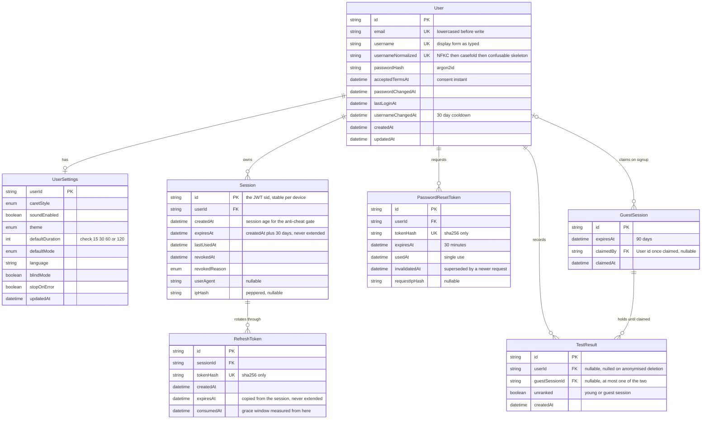
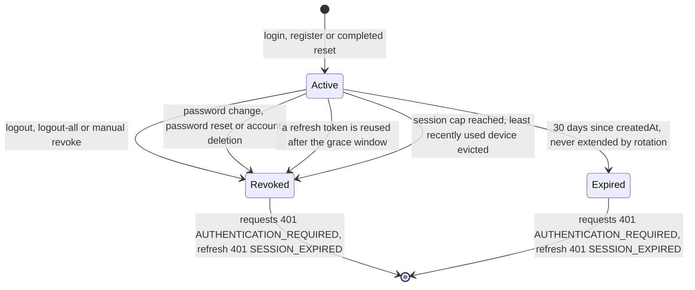
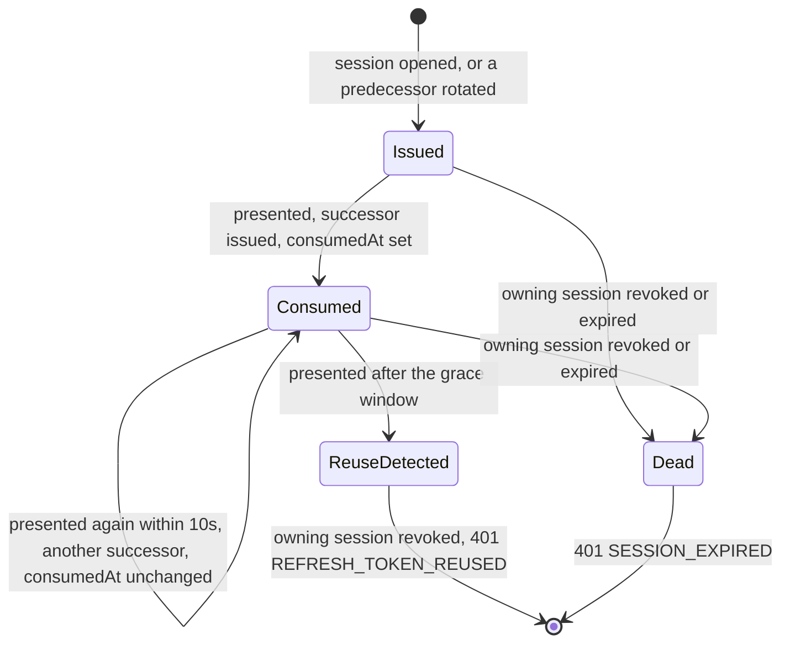
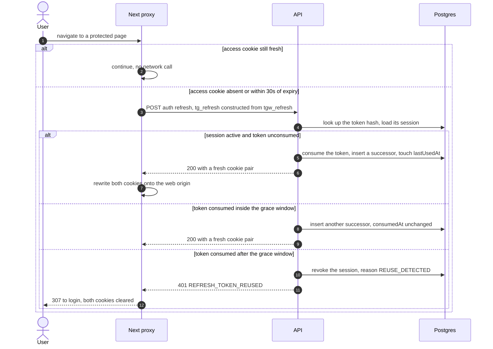
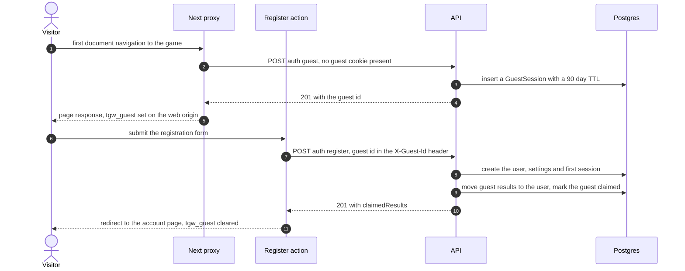
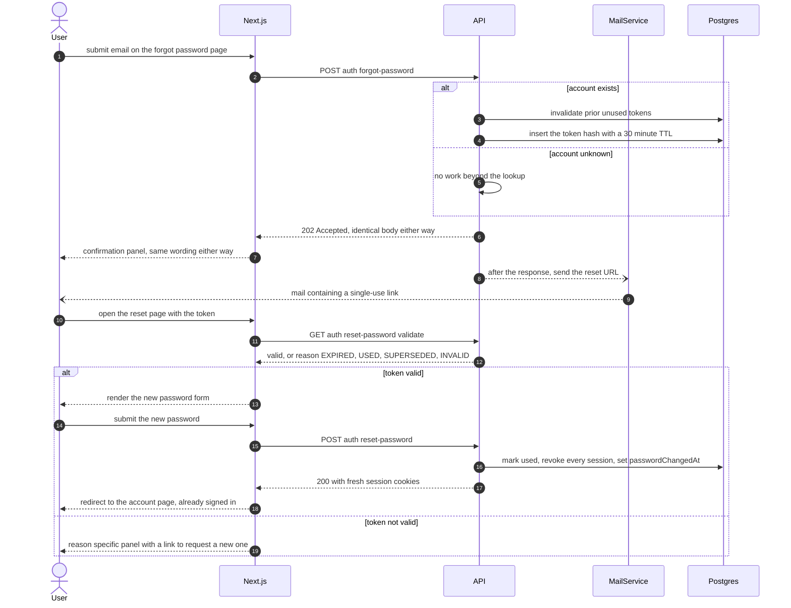
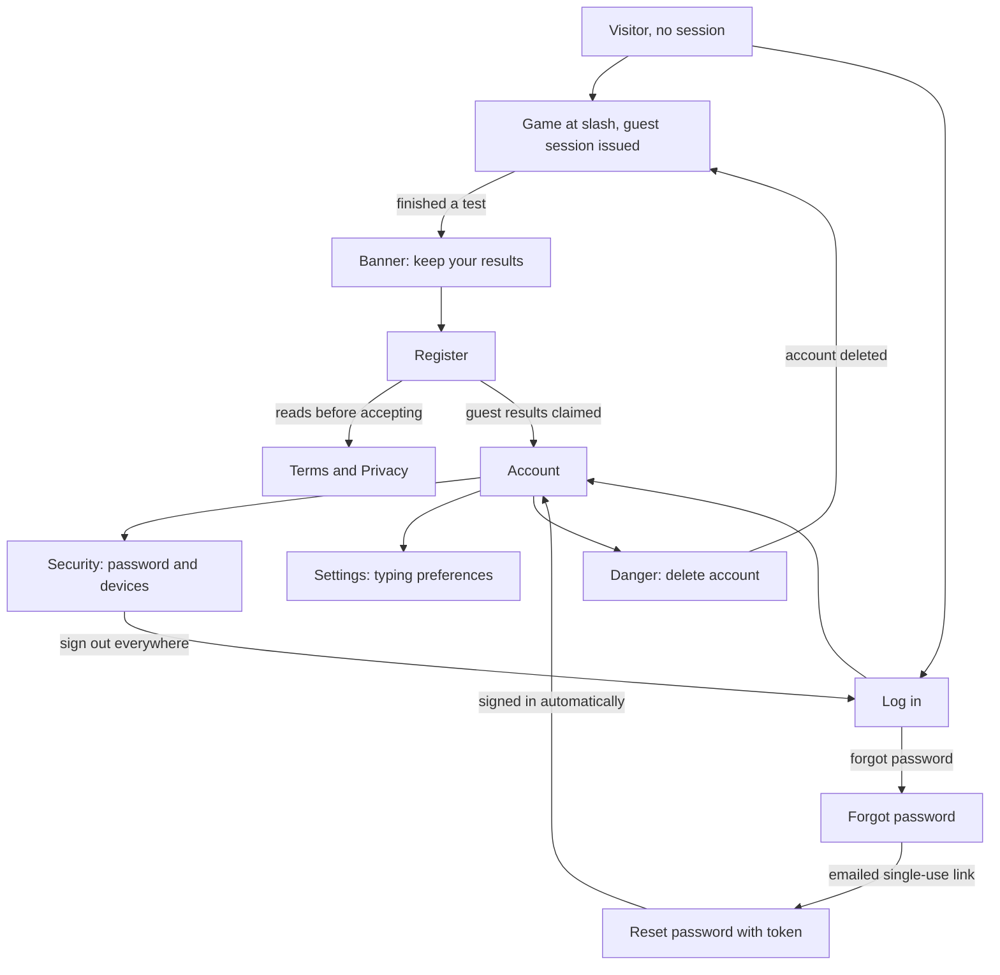
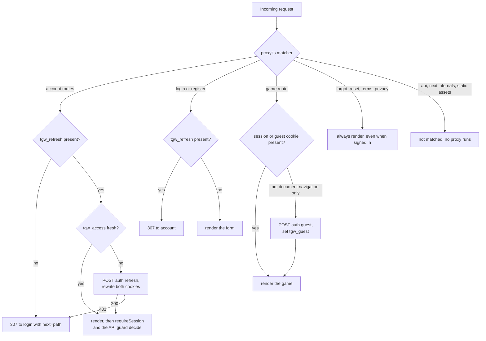

# 001 — Authentication & Users

| | |
| --- | --- |
| **Spec** | 001 |
| **Status** | Implemented |
| **Owner** | Nicolas |
| **Last updated** | 2026-09-11 |
| **Depends on** | [002 — Database & Docker](002-database-and-docker.md) |

## 1. Summary

Identity for the typing game: account creation, credential login, password recovery, session
management via rotating refresh tokens, device session listing, and the user profile/settings that
the typing surface reads. Play is possible without an account — an anonymous guest accumulates
results against a device-scoped session, and those results are claimed into a real account on
signup, so the funnel from "tried it once" to "registered" loses no data.

> **On size.** This spec is deliberately larger than the ~600-line guideline in
> [spec/README.md](../README.md#directory-conventions). Registration, login, refresh, password reset
> and session revocation all mutate the same `Session` model and the same cookie pair; splitting
> them would put one state machine across four documents. Recorded here as the required reason.

> **Revision 2026-09-10.** Fifteen defects found in review are resolved in this revision; each has a
> row in [§ 10](#10-decision-log) (Q6–Q20). The load-bearing changes: `Session` now models a
> **device** and the new `RefreshToken` model holds each rotation, so `sid`, revocation and session
> age all mean what the UI claims they mean; token refresh happens only where a cookie can legally
> be written; the two cookie sets (API origin, web origin) are specified separately; per-IP rate
> limits are keyed on a forwarded client address rather than the BFF's; and the Bearer transport is
> out of scope.

## 2. Scope

**In scope**

- Email + password registration and login.
- Argon2id password hashing.
- Access tokens (JWT, 15 min) and refresh tokens (opaque, rotating, one-time use with a 10-second
  grace window) under a **absolute 30-day session lifetime** that rotation never extends.
- `httpOnly` cookies as the single session transport, in two distinct sets: the API's own cookies on
  the API origin, and the web-origin cookies the Next.js BFF writes (§ 5 *Cookies*).
- **Password reset** by emailed single-use token, including the provider-agnostic mail port it
  needs.
- Logout (single session), logout-all, and revoking one named device session by id.
- Guest sessions, issuance from `proxy.ts`, and the claim-on-signup flow.
- User profile read/update, typing preferences, account deletion with optional result deletion.
- Username uniqueness, Unicode normalisation, confusable and mixed-script rules, reservation.
- A **minimal `TestResult` model** — the columns the claim, anonymise and delete flows need, and
  nothing else. Spec 003 extends the same table (§ 4).
- The frontend pages, Server Actions and route protection for all of the above (§ 6).

**Out of scope** — each becomes its own spec

- **`Authorization: Bearer` transport.** No non-browser client exists, and supporting one honestly
  means returning refresh-token material in a response body, a second rotation path and a second
  test matrix. Deferred until a mobile or CLI client is real; the token model here does not
  preclude it (resolved: Q11).
- OAuth / social login (Google, GitHub) → future spec 00X.
- **Email address verification.** Reset mail proves control of the address at recovery time; a
  separate verify-on-signup flow, with its unverified-account states, is its own feature.
- Changing one's email address (requires verification, therefore blocked on the above).
- Two-factor authentication.
- Roles, permissions, admin surfaces. Every authenticated user has identical authority in v1.
- Transactional email beyond password reset (welcome mail, notifications).
- The typing test lifecycle, passages, result metrics and **aggregate statistics** → spec 003.
  `GET /users/me/stats` is named here because `/account` renders it, but it is specified, built and
  tested in 003.
- Leaderboards → future spec 004.

## 3. User stories

### US-1 — Play without an account

*As a first-time visitor I want to take a typing test immediately so that I can judge the product
before committing to a signup.*

1. The first **document navigation** to the game with no session and no guest cookie issues a guest
   session from `proxy.ts` and sets `tgw_guest` on the response. A Server Component cannot set a
   cookie, so issuance cannot live in the page render (resolved: Q10).
2. A result submitted with only a guest session persists and is returned to the client.
3. Guest results are visible in the current browser for the life of the guest cookie (90 days).
4. A guest session grants no access to `/users/me` or any account endpoint (401
   `AUTHENTICATION_REQUIRED`).
5. Prefetches never mint a guest session; only a real navigation does, so orphan rows are not
   created by the router.

### US-2 — Register

*As a returning visitor I want to create an account so that my results and personal bests persist
across devices.*

1. Registering with a valid, unused email and username creates the user and returns a session.
2. Registration is rejected with 409 `EMAIL_ALREADY_REGISTERED` if the email exists
   (case-insensitive), or 409 `USERNAME_TAKEN` if the normalised username exists.
3. Passwords shorter than 10 characters are rejected with 400 `VALIDATION_FAILED`.
4. The response never contains `passwordHash` or any refresh-token material in the body.
5. If a guest session is presented, every result attached to it is reassigned to the new user, the
   guest session is marked claimed, and `claimedResults` reports the count.
6. Registration is rate-limited to 5 attempts per hour per **client** IP, derived per § 8
   *Client address* — not per BFF address (resolved: Q8).
7. `acceptedTerms: true` is required and the acceptance instant is persisted as `acceptedTermsAt`.
   Validating a consent and then discarding it is not consent.

### US-3 — Log in

*As a registered user I want to log in so that I regain access to my history.*

1. Correct credentials return 200 with an access token and set both session cookies.
2. Wrong password and unknown email both return 401 `INVALID_CREDENTIALS` with an identical
   body and comparable response time — the response must not reveal whether the email exists.
3. Login is rate-limited to 10 attempts per client IP per 15 minutes and 5 per email per 15 minutes.
4. A successful login records `lastLoginAt` and creates a new `Session` row with its first
   `RefreshToken`.
5. Opening a session beyond the 20th active one for that user evicts the least recently used
   session (`revokedReason: SESSION_LIMIT`), so the device list stays bounded and one page long.

### US-4 — Stay logged in

*As a logged-in user I want my session to survive a page reload and a closed browser so that I am
not asked to re-authenticate constantly.*

1. An expired access token plus a valid refresh token returns a new pair (200).
2. Refresh rotates: the presented `RefreshToken` is consumed and a successor is issued **inside the
   same `Session`**. The `Session` row — the device — is not replaced.
3. **Grace window (Q1).** A token already consumed **within the last 10 seconds** may rotate again
   and returns a fresh valid pair. Two tabs refreshing simultaneously therefore both succeed.
4. Reusing a token consumed **more than 10 seconds ago** revokes the whole `Session` and returns 401
   `REFRESH_TOKEN_REUSED` — this is the detection signal for a stolen token.
5. The grace window is measured from the token's *first* use and is not extended by subsequent
   uses, so a token cannot be kept alive indefinitely by polling it every 9 seconds.
6. **Absolute lifetime (resolved: Q16).** A session expires 30 days after it was *created*.
   Rotation issues successors that inherit `Session.expiresAt` verbatim and never extend it, so
   "30 days" means 30 days rather than a sliding window with no ceiling. A refresh against an
   expired or revoked session returns 401 `SESSION_EXPIRED`.
7. Refresh is performed only by `proxy.ts`, a Server Action, or a route handler — the three places
   in Next.js where a cookie can be written. A Server Component never refreshes (resolved: Q7).

### US-5 — Log out, everywhere or on one device

*As a logged-in user I want to log out, to end sessions everywhere, and to kick one specific
device, so that I control access to my account.*

1. `POST /auth/logout` revokes the current session and clears both cookies. It returns 204 even
   when no session was present (idempotent).
2. `POST /auth/logout-all` revokes every session for the user; all other devices lose access on
   their next request.
3. `GET /users/me/sessions` lists active **devices** — one row per `Session`, never one per
   rotation — with the current one flagged, and `DELETE /users/me/sessions/:id` revokes one.
4. Revoking a session that is not the caller's own returns 404 `SESSION_NOT_FOUND` — never 403,
   which would confirm the id exists.
5. Revoking one's *own* current session behaves exactly like logout, cookies included.
6. A revoked session loses access **immediately**, not when its 15-minute access token expires.
   Because `sid` names the stable `Session` and not a rotation row, one revocation invalidates
   every access token that device holds (resolved: Q6).

### US-6 — Recover a forgotten password

*As a user who has forgotten their password I want to reset it by email so that I do not lose my
account and its history.*

1. `POST /auth/forgot-password` with any syntactically valid email returns 202 with an identical
   body whether or not the account exists — no enumeration.
2. When the account exists, a mail is sent containing a single-use link valid for 30 minutes.
3. **The mail is sent after the response is returned** (resolved: Q13). Awaiting an SMTP round trip
   on the known-account branch only would make the endpoint a timing oracle for exactly the fact
   US-6.1 hides.
4. Requesting a second reset invalidates the first token, so only the newest link works.
5. `POST /auth/reset-password` with a valid token sets the new password, marks the token used, and
   **revokes every existing session** for that user.
6. After a successful reset the user is issued a fresh session and is logged in — having just
   proved control of the mailbox, a forced login adds friction without adding security.
7. An expired, unknown or already-used token returns 400 with a distinct `code` per case, so the
   page can say *"this link has expired"* rather than *"something went wrong"*.
8. Reset requests are rate-limited to 3 per email per hour and 10 per client IP per hour.
9. A mail-provider failure does not change the 202 response; it is logged at `error` for
   operators.
10. The reset endpoint does **not** compare the new password against the current hash. Doing so
    turns a link in an inbox into an unauthenticated password-testing oracle (resolved: Q14). The
    equality check stays on `PATCH /users/me/password`, where the caller has already authenticated.

### US-7 — Profile & typing preferences

*As a logged-in user I want to set my display name and typing preferences so that the game behaves
the way I like on every device.*

1. `GET /users/me` returns the profile and settings. Aggregate statistics are **not** part of it —
   they are `GET /users/me/stats` (spec 003), fetched by the one page that renders them
   (resolved: Q15).
2. `PATCH /users/me` accepts a partial update; omitted fields are untouched.
3. Changing the username enforces the same uniqueness and normalisation rules as registration,
   and is limited to once every 30 days (429 `USERNAME_CHANGE_TOO_SOON`).
4. Settings are delivered by `GET /auth/session` on the server render of **every** page that draws
   the typing surface, including `/`, so caret style and sound preference are correct on first
   paint with no flash of defaults. Guests fall back to `localStorage` defaults, which is a flash
   only for a visitor who has no server-side preferences to flash to.
5. `PATCH /users/me/password` changes the password for a logged-in user, requiring the current
   password, and revokes all *other* sessions while keeping the caller's own.

### US-8 — Delete my account

*As a user I want to delete my account, and to choose whether my results go with it, so that I
control my data.*

1. `DELETE /users/me` requires the current password in the body (401 `INVALID_CREDENTIALS` if
   wrong) and the literal confirmation string `"DELETE"`.
2. Deletion removes the user, sessions, refresh tokens, settings and any reset tokens, and revokes
   all access.
3. By default results are **anonymised, not deleted**: `TestResult.userId` is nulled by the
   `onDelete: SetNull` relation and the row is retained, so leaderboard integrity and aggregate
   statistics survive.
4. The deletion form carries a *"Also delete my results and leaderboard entries"* checkbox
   (`deleteResults`, default `false`). When true, every result belonging to the user is deleted
   first, in the same transaction as the user row.
5. Both behaviours are stated on the form before submission — the default is not a silent choice.

## 4. Data model

Prisma (confirmed: [spec 002 § 10](002-database-and-docker.md#10-decision-log), Q3).



### Why `Session` and `RefreshToken` are two models

The first draft stored one row per rotation and called it a session. That single conflation
produced six defects: the device list showed one row per 15-minute refresh; `current: true` was
undecidable because `sid` named a row that rotation had already consumed; revoking a device left
older, unrevoked rows whose access tokens kept working for up to 15 minutes, contradicting the
immediate-revocation guarantee; grace-window forks accumulated unbounded live rows; "revoke all
other sessions" had no definition; and the anti-cheat gate on session age flagged every user who
had just refreshed. Splitting the device from the token it currently holds resolves all six at
once, and it is the reason `sid` is now a stable identifier (resolved: Q6).

```prisma
model User {
  id                 String    @id @default(cuid(2))
  email              String    @unique                    // stored lowercased
  username           String    @unique                    // display form, as typed
  usernameNormalized String    @unique                    // NFKC + casefold + confusable skeleton
  passwordHash       String
  acceptedTermsAt    DateTime                             // set at registration, never null
  passwordChangedAt  DateTime?                            // surfaced on the sessions page
  lastLoginAt        DateTime?
  usernameChangedAt  DateTime?
  createdAt          DateTime  @default(now())
  updatedAt          DateTime  @updatedAt

  settings           UserSettings?
  sessions           Session[]
  resetTokens        PasswordResetToken[]
  results            TestResult[]
  claimedGuestSessions GuestSession[]

  @@index([createdAt])
}

model UserSettings {
  userId          String  @id
  user            User    @relation(fields: [userId], references: [id], onDelete: Cascade)

  caretStyle      CaretStyle @default(SMOOTH)
  soundEnabled    Boolean    @default(false)
  theme           Theme      @default(SYSTEM)
  defaultDuration Int        @default(30)                 // CHECK (15, 30, 60, 120) — see below
  defaultMode     TestMode   @default(TIME)
  language        String     @default("en")               // BCP-47, validated in packages/contracts
  blindMode       Boolean    @default(false)              // hide correctness while typing
  stopOnError     Boolean    @default(false)

  updatedAt       DateTime   @updatedAt
}

model Session {
  id            String    @id @default(cuid(2))            // the JWT `sid`; stable for the device
  userId        String
  user          User      @relation(fields: [userId], references: [id], onDelete: Cascade)

  createdAt     DateTime  @default(now())
  expiresAt     DateTime                                   // createdAt + REFRESH_TOKEN_TTL_DAYS
  lastUsedAt    DateTime  @default(now())                  // shown on the sessions page
  revokedAt     DateTime?
  revokedReason RevocationReason?

  userAgent     String?
  ipHash        String?                                    // hashed with a pepper; never raw

  refreshTokens RefreshToken[]

  @@index([userId, revokedAt])
  @@index([expiresAt])                                     // supports the cleanup job
}

model RefreshToken {
  id         String    @id @default(cuid(2))
  sessionId  String
  session    Session   @relation(fields: [sessionId], references: [id], onDelete: Cascade)

  tokenHash  String    @unique                             // SHA-256 of the opaque token
  createdAt  DateTime  @default(now())
  expiresAt  DateTime                                      // copied from Session.expiresAt
  consumedAt DateTime?                                     // first rotation; grace runs from here

  @@index([sessionId, consumedAt])
  @@index([expiresAt])
}

model PasswordResetToken {
  id            String    @id @default(cuid(2))
  userId        String
  user          User      @relation(fields: [userId], references: [id], onDelete: Cascade)

  tokenHash     String    @unique                           // SHA-256; plaintext exists only in the mail
  expiresAt     DateTime
  usedAt        DateTime?
  invalidatedAt DateTime?                                   // set when a newer token supersedes it
  createdAt     DateTime  @default(now())
  requestIpHash String?

  @@index([userId, usedAt])
  @@index([expiresAt])
}

model GuestSession {
  id        String   @id @default(cuid(2))
  createdAt DateTime @default(now())
  expiresAt DateTime                                        // createdAt + GUEST_SESSION_TTL_DAYS
  claimedBy String?                                         // User.id once claimed
  claimedByUser User? @relation(fields: [claimedBy], references: [id], onDelete: SetNull)
  claimedAt DateTime?

  results   TestResult[]

  @@index([expiresAt])
  @@index([claimedBy])                                      // claim idempotency check filters on it
}

model TestResult {
  id             String        @id @default(cuid(2))
  userId         String?
  user           User?         @relation(fields: [userId], references: [id], onDelete: SetNull)
  guestSessionId String?
  guestSession   GuestSession? @relation(fields: [guestSessionId], references: [id], onDelete: SetNull)

  unranked       Boolean       @default(false)
  createdAt      DateTime      @default(now())

  @@index([userId, createdAt])
  @@index([guestSessionId])
}

enum CaretStyle       { OFF BLOCK UNDERLINE SMOOTH }
enum Theme            { SYSTEM LIGHT DARK }
enum TestMode         { TIME WORDS QUOTE }
enum RevocationReason { LOGOUT LOGOUT_ALL MANUAL_REVOKE REUSE_DETECTED PASSWORD_RESET PASSWORD_CHANGE ACCOUNT_DELETED SESSION_LIMIT }
```

**`TestResult` ownership.** This spec creates the table with the four columns its own flows need —
attribution, the guest link, the anti-cheat flag and a timestamp. Spec 003 adds the metric columns
to the *same* model in its own migration; it does not redefine it (resolved: Q12). `onDelete:
SetNull` on both relations is the anonymisation behaviour of US-8.3 expressed as a constraint
rather than as application code; `deleteResults: true` (US-8.4) deletes the rows explicitly before
the user row, in the same transaction.

**Check constraints.** Prisma has no primitive for these, so both live in raw SQL inside the
initial migration and are asserted by an e2e test that expects a 23514 violation:

```sql
ALTER TABLE "TestResult"
  ADD CONSTRAINT "TestResult_owner_exclusive"
  CHECK (num_nonnulls("userId", "guestSessionId") <= 1);

ALTER TABLE "UserSettings"
  ADD CONSTRAINT "UserSettings_defaultDuration_allowed"
  CHECK ("defaultDuration" IN (15, 30, 60, 120));
```

`<= 1` rather than `= 1`: an anonymised result legitimately has neither owner.

**Index rationale**

- `Session.expiresAt` — the nightly cleanup deletes expired sessions; without it that scan grows
  linearly with all sessions ever created.
- `Session.userId, revokedAt` — the sessions page, logout-all, the session cap eviction and the
  guard's per-request lookup all filter on this pair.
- `RefreshToken.sessionId, consumedAt` — revocation and cleanup walk a session's tokens; the
  rotation path looks up by `tokenHash`, which is already unique.
- `RefreshToken.expiresAt` — the cleanup job again, on the larger of the two tables.
- `GuestSession.claimedBy` — registration checks whether a presented guest session was already
  claimed, and the check must not be a sequential scan on a table that grows with every visitor.
- `PasswordResetToken.userId, usedAt` — invalidating prior tokens on a new request is one indexed
  update.
- `TestResult.userId, createdAt` — account deletion and (in spec 003) history both filter on the
  user and order by time.
- `User.usernameNormalized` — uniqueness must be enforced on the normalised form, so the unique
  index lives there rather than on the display form.

### Username normalisation

Usernames may contain non-ASCII letters: excluding them to dodge homoglyph attacks excludes most of
the world's names to solve a problem that has a real solution (resolved: Q18).

| Stage | Rule |
| --- | --- |
| Accept | NFKC-normalise the input, then require 3–20 code points, each matching `[\p{L}\p{N}_]` |
| Script | At most one script besides `Common` and `Inherited`. `nico_1` and `никола` pass; `nіco` (Latin + Cyrillic) is 400 `VALIDATION_FAILED` with `details[0].message` naming the mixed script |
| Store | `username` keeps the display form as typed; `usernameNormalized` = confusable-skeleton(casefold(NFKC(username))) |
| Compare | Uniqueness and the reserved list are both matched on `usernameNormalized` |

The skeleton mapping is a generated table in `packages/contracts`, derived from the Unicode TR39
`confusables.txt` restricted to the Latin, Greek and Cyrillic blocks — the set that matters for a
Latin-script reserved list. It is regenerated by a committed script, never hand-edited, and it is
the reason `аdmin` with a Cyrillic `а` is 409 `USERNAME_TAKEN` with `reason: "RESERVED"` rather
than a 400.

## 5. API contracts

Base path `/api/v1`. `Auth` column: **none** = public, **access** = valid access token,
**refresh** = valid refresh token.

| Method | Path | Auth | Purpose |
| --- | --- | --- | --- |
| POST | `/auth/register` | none | Create account, open session |
| POST | `/auth/login` | none | Open session |
| POST | `/auth/refresh` | refresh | Rotate the session's refresh token |
| POST | `/auth/logout` | none¹ | Revoke current session |
| POST | `/auth/logout-all` | access | Revoke all sessions |
| GET | `/auth/session` | access | Minimal identity + settings, for the BFF session helper |
| POST | `/auth/guest` | none | Issue a guest session |
| POST | `/auth/forgot-password` | none | Send a reset link |
| GET | `/auth/reset-password/validate` | none | Pre-flight token check for the page |
| POST | `/auth/reset-password` | none | Consume token, set password, open session |
| GET | `/users/me` | access | Profile + settings |
| PATCH | `/users/me` | access | Update profile |
| PATCH | `/users/me/password` | access | Change password |
| PATCH | `/users/me/settings` | access | Update typing preferences |
| GET | `/users/me/sessions` | access | List active device sessions |
| DELETE | `/users/me/sessions/:id` | access | Revoke one device session |
| DELETE | `/users/me` | access | Delete account |
| GET | `/users/username-available` | none | Pre-flight uniqueness check |

`GET /users/me/stats` is rendered by `/account` but specified and owned by spec 003.

¹ `/auth/logout` reads the access token when one is present, but is **not** guarded: US-5.1
requires 204 even with no session, so a client holding a stale token can always reach a clean state.
A guarded endpoint would answer 401 instead.

### Shared auth error codes

Returned by any endpoint in the **access** column, so they are not repeated per endpoint:

| Status | `code` | When |
| --- | --- | --- |
| 401 | `AUTHENTICATION_REQUIRED` | No access token, unknown `sub`, or the `sid` session is revoked, expired or missing |
| 401 | `ACCESS_TOKEN_EXPIRED` | Signature valid, `exp` passed. Distinct so the caller refreshes instead of redirecting to login |
| 401 | `ACCESS_TOKEN_INVALID` | Malformed, or signed with a rotated secret |

### Cookies

Two distinct sets, on two origins, with two different jobs. They are never confused because they
are never named the same thing (resolved: Q9).

**Web origin — `tgw_*`.** The only cookies a browser ever holds. Written by `proxy.ts`, Server
Actions and route handlers; read by `proxy.ts` and the server-side fetchers.

| Cookie | Attributes | Lifetime |
| --- | --- | --- |
| `tgw_access` | `HttpOnly; Secure; SameSite=Lax; Path=/; Domain=<WEB_COOKIE_DOMAIN>` | `JWT_ACCESS_TTL` |
| `tgw_refresh` | `HttpOnly; Secure; SameSite=Lax; Path=/` | until `Session.expiresAt` |
| `tgw_guest` | `HttpOnly; Secure; SameSite=Lax; Path=/` | `GUEST_SESSION_TTL_DAYS` |

`Path=/` on all three, because the Next.js server reads them on every route — the first draft's
`Path=/api/v1/auth` was an API-origin path that no web-origin request ever matches, so the refresh
cookie would simply never have been sent. `SameSite=Lax` rather than `Strict`: a user arriving from
their mail client (the reset link) or any external link must not get a logged-out first paint.
CSRF is covered by Next.js's Origin check on Server Actions and by route handlers rejecting a
cross-origin `Origin` header; `Lax` already withholds cookies from cross-site POSTs.
`Secure` is omitted only when `NODE_ENV !== "production"`.

**API origin — `tg_*`.** Emitted by the API on every session-opening response, consumed by the BFF
(which translates them onto the web origin) and by direct clients: the Supertest e2e suite, and
`curl` during development. They are also the seam a future Bearer or native client would replace.

| Cookie | Attributes | Lifetime |
| --- | --- | --- |
| `tg_access` | `HttpOnly; Secure; SameSite=Lax; Path=/; Domain=<COOKIE_DOMAIN>` | `JWT_ACCESS_TTL` |
| `tg_refresh` | `HttpOnly; Secure; SameSite=Strict; Path=/api/v1/auth` | until `Session.expiresAt` |
| `tg_guest` | `HttpOnly; Secure; SameSite=Lax; Path=/` | `GUEST_SESSION_TTL_DAYS` |

The BFF authenticates to the API by sending `Cookie: tg_access=<jwt>` (and `tg_refresh` on the
refresh call) that it constructs from the `tgw_*` values it holds. The API's guard reads the access
token from the `tg_access` cookie and from nowhere else.

**Guest id on the wire.** The BFF sends the guest id as `X-Guest-Id`, read server-side from the
httpOnly `tgw_guest` cookie. The API accepts either that header or its own `tg_guest` cookie;
the header wins when both are present.

### POST `/auth/register`

```json
{
  "email": "nicolas@example.com",
  "username": "nico",
  "password": "correct horse battery",
  "acceptedTerms": true
}
```

| Field | Rule |
| --- | --- |
| `email` | required, valid email, ≤ 254 chars, trimmed, lowercased before storage |
| `username` | required, per § 4 *Username normalisation*, not in the reserved list |
| `password` | required, 10–128 chars, must not equal the email or username |
| `acceptedTerms` | required, must be `true`; persisted as `acceptedTermsAt` |

`201 Created`:

```json
{
  "user": {
    "id": "clx0f9a2b0000v3t5n7m1b0af",
    "email": "nicolas@example.com",
    "username": "nico",
    "createdAt": "2026-09-10T14:32:05.123Z"
  },
  "accessToken": "eyJhbGciOiJIUzI1NiIs...",
  "expiresIn": 900,
  "claimedResults": 3
}
```

`expiresIn` is derived from `JWT_ACCESS_TTL`, never a literal — the two must not be able to drift.

| Status | `code` | When |
| --- | --- | --- |
| 400 | `VALIDATION_FAILED` | Any schema rule violated, mixed script included; `details[]` lists offending paths |
| 409 | `EMAIL_ALREADY_REGISTERED` | Email exists (case-insensitive) |
| 409 | `USERNAME_TAKEN` | Normalised username exists, or is reserved |
| 429 | `RATE_LIMIT_EXCEEDED` | > 5 registrations per client IP per hour |

### POST `/auth/login`

```json
{ "email": "nicolas@example.com", "password": "correct horse battery" }
```

`200 OK` — identical body to register, minus `claimedResults`. Same `Set-Cookie` headers.

| Status | `code` | When |
| --- | --- | --- |
| 400 | `VALIDATION_FAILED` | Missing field |
| 401 | `INVALID_CREDENTIALS` | Unknown email **or** wrong password |
| 429 | `RATE_LIMIT_EXCEEDED` | Per-IP or per-email limit hit |

An unknown email still runs an Argon2 verify against a fixed dummy hash, so the two branches cost
the same. This is the one endpoint where the dummy verify is the right tool: both branches are
otherwise a single indexed lookup, and the hash dominates the response time.

### POST `/auth/refresh`

Token from the `tg_refresh` cookie. There is no body variant — a body-carried refresh token exists
only for the Bearer transport, which is out of scope (§ 2).

`200 OK`:

```json
{ "accessToken": "eyJhbGciOiJIUzI1NiIs...", "expiresIn": 900 }
```

Sets a new `tg_access` and a **new** `tg_refresh`.

Decision procedure, in order:

1. Hash the presented token; look up the `RefreshToken` and its `Session`. No match → 401
   `REFRESH_TOKEN_INVALID`.
2. `Session.revokedAt` set, or `Session.expiresAt` passed → 401 `SESSION_EXPIRED`. Checked before
   step 3, so a refresh after `logout-all` is not reported as theft.
3. `consumedAt` set and `now - consumedAt <= REFRESH_GRACE_SECONDS` (10 s) → issue another
   successor in the same session, leaving `consumedAt` at its original value (US-4.3, US-4.5).
4. `consumedAt` set and older than the grace window → revoke the `Session`
   (`revokedReason: REUSE_DETECTED`) → 401 `REFRESH_TOKEN_REUSED`. Revoking the session kills every
   token in it; there is no per-token revocation flag to keep in step.
5. Otherwise set `consumedAt = now`, insert a successor `RefreshToken` with
   `expiresAt = Session.expiresAt`, touch `Session.lastUsedAt`, return the new pair.

Steps 3 and 5 both leave the `Session` row untouched apart from `lastUsedAt`, which is what makes
`sid` stable and immediate revocation total.





The two diagrams are the point of the split: the left-hand lifecycle belongs to a device the user
recognises on the sessions page, the right-hand one to a credential that turns over every fifteen
minutes and that the user never sees.

| Status | `code` | When |
| --- | --- | --- |
| 401 | `REFRESH_TOKEN_MISSING` | No `tg_refresh` cookie |
| 401 | `REFRESH_TOKEN_INVALID` | Hash matches no token |
| 401 | `REFRESH_TOKEN_REUSED` | Consumed beyond the grace window → session revoked |
| 401 | `SESSION_EXPIRED` | Session `expiresAt` passed or `revokedAt` set |

Refresh is initiated only from `proxy.ts`, a Server Action or a route handler (US-4.7). The
sequence below is the `proxy.ts` path, which is the one that runs for an ordinary navigation.



### POST `/auth/logout` · `/auth/logout-all`

`204 No Content`, with `Set-Cookie` clearing `tg_access` and `tg_refresh`. Both are idempotent;
`/auth/logout` returns 204 even with no valid session, so a client with a stale token can always
reach a clean state. `logout` sets `revokedReason: LOGOUT` on the caller's `Session`; `logout-all`
sets `LOGOUT_ALL` on every active session for the user, the caller's included.

### GET `/auth/session`

The session helper's endpoint: everything a server render needs to know who is asking and how to
draw the typing surface, and nothing that costs a join beyond `UserSettings` (resolved: Q15).

`200 OK`:

```json
{
  "user": { "id": "clx0f9a2b0000v3t5n7m1b0af", "username": "nico" },
  "settings": {
    "caretStyle": "SMOOTH",
    "soundEnabled": false,
    "theme": "SYSTEM",
    "defaultDuration": 30,
    "defaultMode": "TIME",
    "language": "en",
    "blindMode": false,
    "stopOnError": false
  }
}
```

Errors: the shared auth codes. Budget `p95 ≤ 25 ms` — it runs on every protected render, so it may
never grow an aggregate.

### POST `/auth/guest`

Empty body. `201 Created`:

```json
{ "guestId": "clx0g1h3c0001v3t5n7m1b0zz", "expiresAt": "2026-12-09T14:32:05.123Z" }
```

Also sets `tg_guest` on the API origin. Called by `proxy.ts` on a document navigation with no guest
cookie (US-1.1); `proxy.ts` writes `tgw_guest` from the response body.

If a valid guest session is already presented, it is returned with 200 rather than a new one being
minted — otherwise a client that retries on network failure accumulates orphan guest sessions. The
90-day lifetime is confirmed (Q2) and is treated as strictly necessary: the guest id is never used
for analytics, and it is disclosed in the privacy notice.

Rate-limited to 20 per client IP per hour; the cap exists because this endpoint writes a row for an
unauthenticated caller.



### POST `/auth/forgot-password`

```json
{ "email": "nicolas@example.com" }
```

`202 Accepted` — **always**, for any syntactically valid email:

```json
{ "message": "If an account exists for that address, a reset link is on its way." }
```

Behaviour when the account exists, **before** the response is returned:

1. Any prior unused token for the user gets `invalidatedAt = now` (US-6.4).
2. A new token is minted: 32 random bytes, base64url; only its SHA-256 is stored; `expiresAt = now
   - PASSWORD_RESET_TTL_MINUTES`.

**After** the response is returned (US-6.3), the mail is sent via `MailService` containing
`${APP_PUBLIC_URL}/reset-password?token=<plaintext>`. A provider failure is logged at `error` with
the `requestId`; the client has already been answered (US-6.9).

Both branches therefore share the same pre-response shape — one indexed lookup, and on the known
branch two writes — while the only step measured in hundreds of milliseconds, the SMTP round trip,
happens on neither branch's critical path. This replaces the first draft's dummy Argon2 verify,
which equalised the two branches against the wrong cost and left the endpoint a timing oracle
(resolved: Q13).

| Status | `code` | When |
| --- | --- | --- |
| 400 | `VALIDATION_FAILED` | Not a syntactically valid email |
| 429 | `RATE_LIMIT_EXCEEDED` | > 3 per email per hour, or > 10 per client IP per hour |

### GET `/auth/reset-password/validate?token=<plaintext>`

Lets the page render *"this link has expired"* before the user types a new password.

`200 OK`:

```json
{ "valid": false, "reason": "EXPIRED" }
```

`reason` is `null` when `valid` is `true`, otherwise `"EXPIRED"`, `"USED"`, `"INVALID"` or
`"SUPERSEDED"`. Always 200, never 404 — the shape is the answer. Rate-limited to 20 per client IP
per hour. Checking a token here does **not** consume it.



Note that `validate` never consumes the token: a mail client prefetching the link must not be able
to burn it before the user clicks.

### POST `/auth/reset-password`

```json
{ "token": "sYm9y...", "password": "a brand new passphrase" }
```

`200 OK` — same body and `Set-Cookie` headers as login (US-6.6). All prior sessions are revoked
with `revokedReason: PASSWORD_RESET` before the new one is created, and `passwordChangedAt` is set.

| Status | `code` | When |
| --- | --- | --- |
| 400 | `VALIDATION_FAILED` | Password rules violated |
| 400 | `RESET_TOKEN_INVALID` | Hash matches nothing |
| 400 | `RESET_TOKEN_EXPIRED` | Past `expiresAt` |
| 400 | `RESET_TOKEN_USED` | `usedAt` already set |
| 400 | `RESET_TOKEN_SUPERSEDED` | `invalidatedAt` set by a newer request |
| 429 | `RATE_LIMIT_EXCEEDED` | > 10 attempts per client IP per hour |

Distinct token codes are intentional: the token itself is the secret, and by the time it is
presented, telling its holder *why* it failed leaks nothing while removing a dead end from the UX.

There is deliberately no `PASSWORD_UNCHANGED` here (US-6.10). Answering "that is already your
password" to whoever holds the link turns a forwarded or intercepted mail into an offline-style
password oracle, rate-limited only by IP. The check belongs on the authenticated endpoint
(resolved: Q14).

### GET `/users/me`

`200 OK`:

```json
{
  "id": "clx0f9a2b0000v3t5n7m1b0af",
  "email": "nicolas@example.com",
  "username": "nico",
  "createdAt": "2026-09-10T14:32:05.123Z",
  "lastLoginAt": "2026-09-10T14:32:05.123Z",
  "passwordChangedAt": "2026-09-01T09:00:00.000Z",
  "settings": {
    "caretStyle": "SMOOTH",
    "soundEnabled": false,
    "theme": "SYSTEM",
    "defaultDuration": 30,
    "defaultMode": "TIME",
    "language": "en",
    "blindMode": false,
    "stopOnError": false
  }
}
```

No `stats` key: aggregates come from `GET /users/me/stats` (spec 003) and are fetched only by
`/account`. Errors: the shared auth codes.

### PATCH `/users/me`

```json
{ "username": "nicolas" }
```

`200 OK` with the same body as `GET /users/me`.

| Status | `code` | When |
| --- | --- | --- |
| 400 | `VALIDATION_FAILED` | Username rules violated; empty body |
| 409 | `USERNAME_TAKEN` | Taken or reserved |
| 429 | `USERNAME_CHANGE_TOO_SOON` | Changed within the last 30 days; `details[0]` is `{ path: "username", message: "<ISO-8601 retryAfter>" }` |

### PATCH `/users/me/password`

```json
{ "currentPassword": "correct horse battery", "newPassword": "a brand new passphrase" }
```

`204 No Content`. Revokes every session **except the caller's own `Session`**
(`revokedReason: PASSWORD_CHANGE`) — unambiguous now that a session is a device — and sets
`passwordChangedAt`. Errors: 400 `VALIDATION_FAILED`, 400 `PASSWORD_UNCHANGED`, 401
`INVALID_CREDENTIALS`.

### PATCH `/users/me/settings`

Any subset of the `settings` object. Unknown keys are a 400 (`forbidNonWhitelisted`), not a silent
drop — a typo'd preference key must be loud. `defaultDuration` outside `15 | 30 | 60 | 120` is a
400 from the zod schema and, if it ever reaches the database, a check-constraint violation mapped
to 400. `200 OK` returns the full settings object.

### GET `/users/me/sessions`

`200 OK`:

```json
{
  "data": [
    {
      "id": "clx0h2i4d0002v3t5n7m1b0qq",
      "current": true,
      "userAgent": "Mozilla/5.0 (Macintosh; Intel Mac OS X 10_15_7)…",
      "createdAt": "2026-09-10T14:32:05.123Z",
      "lastUsedAt": "2026-09-10T15:02:41.000Z",
      "expiresAt": "2026-10-10T14:32:05.123Z"
    }
  ],
  "pageInfo": { "nextCursor": null, "hasNextPage": false }
}
```

One row per active `Session` — a device, not a rotation. `current` is `true` for exactly the row
whose id equals the `sid` claim of the presenting access token; that comparison is meaningful only
because `sid` no longer changes when the token rotates.

Lists sessions with `revokedAt IS NULL AND expiresAt > <clock now>`, ordered `current` first then
`lastUsedAt` descending. Never returns token material or raw IPs.

**Pagination exemption.** The set is capped at `SESSION_MAX_ACTIVE` (20) by US-3.5, so it is always
one page and the presentation ordering is safe. The envelope keeps `pageInfo` for consistency with
[spec/README § Pagination](../README.md#pagination), always `{ "nextCursor": null, "hasNextPage":
false }`. Stated here because a reader is otherwise entitled to expect a working cursor.

### DELETE `/users/me/sessions/:id`

`204 No Content`, `revokedReason: MANUAL_REVOKE`. Revoking a `Session` invalidates every access
token and every refresh token that device holds, on its next request (US-5.6). If `:id` is the
caller's own session, both cookies are cleared in the response (US-5.5).

| Status | `code` | When |
| --- | --- | --- |
| 404 | `SESSION_NOT_FOUND` | Unknown id, another user's id, or already revoked (US-5.4) |

### DELETE `/users/me`

```json
{ "password": "correct horse battery", "confirm": "DELETE", "deleteResults": false }
```

`204 No Content`, cookies cleared. `deleteResults` defaults to `false` → results anonymised by the
`onDelete: SetNull` relation. When `true`, the user's results are deleted first. The whole
operation runs in one transaction.

| Status | `code` | When |
| --- | --- | --- |
| 400 | `VALIDATION_FAILED` | `confirm` ≠ `"DELETE"`; `deleteResults` not a boolean |
| 401 | `INVALID_CREDENTIALS` | Wrong password |

### GET `/users/username-available?username=nico`

`200 OK` → `{ "available": false, "reason": "TAKEN" }` where `reason` is `null`, `"TAKEN"`,
`"RESERVED"`, `"INVALID_FORMAT"` or `"MIXED_SCRIPT"`. Rate-limited to 30 per minute per client IP
so it cannot be used to enumerate the user list.

### Mail port

`MailService` is an interface with one method per template, injected by driver:

```
sendPasswordReset(to: string, resetUrl: string, expiresInMinutes: number): Promise<void>
```

| Driver | `MAIL_DRIVER` | Used in |
| --- | --- | --- |
| SMTP (nodemailer) | `smtp` | Local development → Mailpit at `localhost:1025`, UI on `:8025` |
| Amazon SES | `ses` | Production (resolved: Q22) |
| No-op recorder | `memory` | Tests — records calls in an array, asserts the reset URL |

**The SES driver** uses `@aws-sdk/client-sesv2`'s `SendEmailCommand`, not SES's SMTP endpoint. The
SDK resolves credentials from the default provider chain, so in production the container's IAM task
role signs the call and there is no mail secret in the environment at all — the SMTP endpoint would
require long-lived SMTP credentials to store and rotate. `AWS_REGION` is required when the driver is
`ses`; `SES_CONFIGURATION_SET` is optional and is what bounce and complaint events are published
through.

Three pieces of setup are SES-specific, none of which block implementation and all of which block
the first production send:

- **Sandbox removal.** A new SES account may only send to verified identities, capped at 200
  messages a day. Production access is a support request with a turnaround measured in days, so it
  is raised when the deploy is planned, not when it ships.
- **Domain identity, Easy DKIM, SPF and a DMARC record** on the sending domain. Reset mail in a
  spam folder is indistinguishable from a broken feature, and this is the whole of the difference.
- **Reputation.** SES suspends an account over roughly 5% bounces or 0.1% complaints. The exposure
  here is structurally small: `/auth/forgot-password` sends nothing for an address that has no
  account (§ 5), so the only recipients are addresses that completed registration. Wire the
  configuration set's event destination before volume grows, rather than discovering the rate from
  a suspension notice.

Send timeout 5 s. Because sending happens after the response (US-6.3), a failure cannot alter a
status code; it is caught, logged with the `requestId`, and dropped. Only the plaintext token
appears in the mail; it is never logged, in any environment. The e2e suite awaits the recorder's
`flush()` so "after the response" does not mean "after the test".

## 6. Frontend pages & routes

`apps/web`, Next.js App Router. Server Components by default; `"use client"` only where noted.
No page calls NestJS directly — everything goes through a Server Action or a server-side fetcher
(see [ARCHITECTURE.md § 4](../../ARCHITECTURE.md#4-frontend-architecture-nextjs-app-router)).

### Where a cookie may be written

Next.js permits `cookies().set()` in a Server Action, a route handler and `proxy.ts`, and throws
in a Server Component. Every part of this section obeys that, which is what makes the refresh path
in `lib/session.ts` correct (resolved: Q7).

| Surface | May write cookies | Refreshes the session |
| --- | --- | --- |
| `proxy.ts` | yes | **yes** — the normal path for a navigation |
| Server Action | yes | yes, via `apiFetch` on a single `ACCESS_TOKEN_EXPIRED` |
| Route handler (`app/api/*`) | yes | yes, same helper |
| Server Component / `getSession()` | **no** | **no** — returns `null` and lets the caller redirect |

The first draft refreshed inside `getSession()` during an RSC render. The rotated token could not
be persisted, so the next render replayed the consumed one; past the 10-second grace window that is
`REFRESH_TOKEN_REUSED`, and the spec's own reuse detector logged every user out roughly every
fifteen minutes.

### Route map

| Route | Group | Auth | Rendering | Purpose |
| --- | --- | --- | --- | --- |
| `/` | `(game)` | public, guest session issued by `proxy.ts` | RSC shell + client typing surface | Play. Owned by spec 003; this spec owns its auth banners and the settings it is rendered with |
| `/login` | `(auth)` | public | Static RSC + client form | Credential login |
| `/register` | `(auth)` | public | Dynamic RSC + client form | Signup, guest-claim notice |
| `/forgot-password` | `(auth)` | public | Static RSC + client form | Request a reset link |
| `/reset-password` | `(auth)` | public + `?token` | Dynamic RSC validates the token, client form | Set a new password |
| `/terms` | `(legal)` | public | Static RSC | Terms accepted at registration (US-2.7) |
| `/privacy` | `(legal)` | public | Static RSC | Includes the guest-cookie disclosure (Q2) |
| `/account` | `(account)` | required | Dynamic RSC | Profile, stats, username change |
| `/account/security` | `(account)` | required | Dynamic RSC + client forms | Password change, active sessions |
| `/account/settings` | `(account)` | required | Dynamic RSC + client form | Typing preferences |
| `/account/danger` | `(account)` | required | Dynamic RSC + client form | Delete account |

`/login` and `/forgot-password` are statically rendered because nothing in them reads a cookie:
the "already signed in" redirect lives in `proxy.ts` alone (resolved: Q17). `/register` is dynamic
only because of the guest-results banner.



Redirect, refresh and guest-issuance rules, as enforced by `proxy.ts`:



Two deliberate departures from "the proxy never calls the API":

- **Refresh.** It fires only when `tgw_access` is absent or within 30 s of its `exp`, decoded
  without verification — so at most once per 15 minutes per client, not once per prefetch. Doing it
  here is what keeps prefetched RSC payloads from rendering as logged-out redirects.
- **Guest issuance.** Only on a document navigation (`Sec-Fetch-Dest: document`) with neither a
  session nor a guest cookie. Prefetches are excluded so the router cannot mint orphan rows
  (US-1.5).

Both are recorded in [ARCHITECTURE.md § 4](../../ARCHITECTURE.md#route-protection); the
authoritative auth check remains the Nest guard plus `requireSession()`.

### Layouts

| File | Responsibility |
| --- | --- |
| `app/(auth)/layout.tsx` | Centred narrow card. **No session read and no redirect** — that would make every page in the group dynamic and would also fire on `/forgot-password` and `/reset-password`, which a signed-in user is entitled to visit. `proxy.ts` owns the redirect |
| `app/(legal)/layout.tsx` | Prose container for `/terms` and `/privacy`. Fully static |
| `app/(account)/layout.tsx` | Calls `requireSession()` (redirects to `/login?next=<path>` when absent), fetches `GET /users/me` **once**, renders the account nav, and passes the profile down. Child pages do not re-fetch |
| `app/layout.tsx` | Header with the auth state: username + logout for authenticated users, "Log in / Sign up" otherwise. Reads `getSession()`, which is `cache()`-wrapped |

### `/login`

- **Data:** none server-side; the page is static.
- **Client component:** `features/auth/login-form.tsx` — email, password, "Forgot password?" link to
  `/forgot-password`, submit.
- **Server Action:** `loginAction`.
- **Validation:** the shared zod schema from `packages/contracts`, client-side for instant feedback
  and again in the action — client validation is UX, never the enforcement point.
- **On success:** cookies set by the action, then `redirect(next ?? "/account")`.
- **Error mapping:** `INVALID_CREDENTIALS` → one form-level message, *"Email or password is
  incorrect."* placed on the form, not per-field, so the UI does not disclose which half was wrong.
  `RATE_LIMIT_EXCEEDED` → *"Too many attempts. Try again in N minutes."*
- **`?next=` handling:** accepted only when it starts with a single `/` and is not `//`; anything
  else is discarded and the user goes to `/account`. Without this the parameter is an open redirect.
- **States:** idle · submitting (button disabled, spinner, inputs read-only) · error.
- **a11y:** the form error is in `role="alert"`, focus moves to it on failure; inputs carry
  `autoComplete="email"` / `"current-password"`.

```
┌──────────────────────────────┐
│         Log in               │
│  Email    [______________]   │
│  Password [______________]   │
│                Forgot? →     │
│  [        Log in         ]   │
│  New here? Create an account │
└──────────────────────────────┘
```

### `/register`

- **Server-side:** reads the `tgw_guest` cookie and, if present, fetches the guest result count to
  render *"You have 3 unsaved results — creating an account keeps them."* (US-2.5 made visible).
- **Client component:** `features/auth/register-form.tsx` — email, username, password,
  `acceptedTerms` checkbox whose label links to `/terms` and `/privacy` in new tabs.
- **Username availability:** debounced 400 ms call to `/users/username-available` through a BFF
  route handler, showing available / taken / reserved / invalid inline. Advisory only; the
  authoritative check is the 409 on submit. A mixed-script entry says which two scripts collided —
  "looks like Latin and Cyrillic mixed" is actionable, "invalid" is not.
- **Password field:** live rule checklist (length, not equal to email/username). No strength meter —
  it implies precision the rules do not have.
- **Server Action:** `registerAction`, which forwards the guest id as `X-Guest-Id`.
- **On success:** `redirect("/account")`, and if `claimedResults > 0` a toast: *"3 results added to
  your account."*
- **Error mapping:** `EMAIL_ALREADY_REGISTERED` → on the email field, with a link to `/login`
  prefilled via `?email=`. `USERNAME_TAKEN` → on the username field.

### `/forgot-password`

- **Client component:** `features/auth/forgot-password-form.tsx` — email only.
- **Server Action:** `forgotPasswordAction`.
- **On success:** the form is replaced by a confirmation panel — *"If an account exists for that
  address, a reset link is on its way. The link expires in 30 minutes."* The wording is identical
  whether or not the account exists (US-6.1), and the UI must never branch on existence.
- **Resend:** a resend button appears after 60 seconds, subject to the same server-side limit; on
  429 it shows *"Please wait before requesting another link."*
- **Copy note:** because the mail is sent after the response (US-6.3), the panel says "on its way",
  not "sent" — the API has not observed a successful send at the time it answers.

### `/reset-password`

- **Server-side:** reads `?token`, calls `GET /auth/reset-password/validate`, and branches **before**
  rendering a form:
  - no `token` param → *"This link is incomplete"* + link to `/forgot-password`;
  - `valid: false` → a reason-specific panel (`EXPIRED` / `USED` / `SUPERSEDED` / `INVALID`), each
    offering "Request a new link";
  - `valid: true` → the form.
- **Client component:** `features/auth/reset-password-form.tsx` — new password, confirm password
  (matched client-side only; the API takes one field).
- **Server Action:** `resetPasswordAction`.
- **On success:** logged in (US-6.6) → `redirect("/account")` with a toast *"Password updated. You
  were signed out on all other devices."*
- **Error mapping:** the token can expire between page load and submit, so the action's
  `RESET_TOKEN_*` errors render the same reason panels rather than a form error. There is no
  `PASSWORD_UNCHANGED` state on this page (US-6.10) — reusing the old password succeeds silently,
  which is the correct outcome for someone who has just proved control of the mailbox.
- **Security:** the token stays in the URL and is never written to `localStorage` or a client-side
  log; the page sets `robots: noindex` metadata.

### `/account`

- **Data:** the profile from the layout — no fetch of its own. **Stats** come from
  `GET /users/me/stats` (spec 003) in a `<Suspense>` boundary, so the profile paints without
  waiting on an aggregate. Until spec 003 exists, the boundary renders the empty state below and
  the panel is behind no feature flag — an absent endpoint is an empty stats panel, not a broken
  page.
- **Sections:** identity (username with an inline edit, email read-only with a *"changing your email
  isn't available yet"* note, member since), stats summary, a link to full history (spec 003).
- **Client component:** `features/account/username-form.tsx`.
- **Server Action:** `updateProfileAction`, then `revalidatePath("/account")`.
- **Error mapping:** `USERNAME_CHANGE_TOO_SOON` → *"You can change your username again on
  {date}."*, computed from `details.retryAfter`. `VALIDATION_FAILED` on a mixed-script username
  names both scripts.
- **Empty state:** zero tests → *"No tests yet"* with a link to `/`, not a zeroed stats grid.

### `/account/security`

Two independent panels on one page, because both concern credentials and both revoke sessions.

1. **Change password** — `features/account/password-form.tsx`, current + new password,
   `changePasswordAction`. On success: *"Password updated. Other devices were signed out."* Errors:
   `INVALID_CREDENTIALS` on the current-password field, `PASSWORD_UNCHANGED` on the new one — this
   is the endpoint that keeps that check.
2. **Active devices** — RSC list from `GET /users/me/sessions`, each row showing a device
   description parsed from the user agent, `lastUsedAt` as relative time, and *"This device"* on the
   current one. Row ids are stable for the life of the device session, so a revoke button cannot
   go stale between render and click merely because the token rotated. Each non-current row has a
   **Revoke** button (`revokeSessionAction`, then `revalidatePath`). Revoking the current row is not
   offered — the header's Log out does that. A **Sign out everywhere** button (`logoutAllAction`)
   sits below, behind a confirm dialog, and redirects to `/login`.
   - **Heading:** *"Devices"*, not *"Sessions"* — the rows are now one per device, and the word
     should say so.
   - **Error mapping:** `SESSION_NOT_FOUND` (the row was already gone) → refresh the list silently
     rather than showing an error; the user's intent was satisfied either way.
   - `passwordChangedAt` is displayed above the list for context.

### `/account/settings`

- **Data:** `settings` from the layout's profile.
- **Client component:** `features/account/settings-form.tsx` — caret style (radio, with a live
  preview of the caret), sound toggle, theme (system/light/dark), default duration (15/30/60/120),
  default mode, language, blind mode, stop-on-error.
- **Server Action:** `updateSettingsAction`, per-field on change, debounced 500 ms, with an optimistic
  update via `useOptimistic` and a revert plus toast on failure. Optimistic is appropriate here:
  these writes are small, idempotent, and a stale toggle is a visible lie.
- **Guests:** the page is auth-only; a guest reaching it is redirected to `/login?next=/account/settings`.
  Guest preferences live in `localStorage` and are not synced (spec 003 owns that).

### `/account/danger`

- **Client component:** `features/account/delete-account-form.tsx`.
- **Fields:** current password, a checkbox *"Also delete my results and leaderboard entries"*
  (`deleteResults`, unchecked by default), and a text input requiring the literal `DELETE`.
- **Copy, stated before submission (US-8.5):**
  - unchecked → *"Your account is deleted. Your past results are kept without your name attached, so
    leaderboards stay accurate."*
  - checked → *"Your account and every result you have recorded are deleted permanently. This cannot
    be undone."*
- **Server Action:** `deleteAccountAction` → on success clears cookies and `redirect("/?deleted=1")`,
  where the game page shows a single confirmation toast.
- **Submit** is disabled until the confirmation text matches exactly and a password is present.

### `/` — the game route's obligation to this spec

Spec 003 owns the page. This spec owns two things on it: the "keep your results" banner after a
finished test for a guest, and the fact that the RSC passes `settings` from `getSession()` into the
typing surface as props (US-7.4). An authenticated user therefore paints with their own caret style
and sound preference on first frame. A guest paints with `localStorage` values, or with defaults on
a first visit — there is no server-side preference to flash to, so there is no flash to prevent.

### Server Actions

All in `app/(auth)/actions.ts` and `app/(account)/actions.ts`, all `"use server"`, all returning a
discriminated union `{ ok: true, … } | { ok: false, code: string, details?: … }` so the client never
sees a thrown error boundary for an expected 4xx.

| Action | Calls | On success |
| --- | --- | --- |
| `loginAction` | `POST /auth/login` | Set cookies, redirect |
| `registerAction` | `POST /auth/register` with `X-Guest-Id` | Set cookies, clear the guest cookie, redirect |
| `forgotPasswordAction` | `POST /auth/forgot-password` | Render the confirmation panel |
| `resetPasswordAction` | `POST /auth/reset-password` | Set cookies, redirect |
| `logoutAction` | `POST /auth/logout` | Clear cookies, `revalidatePath("/", "layout")`, redirect |
| `logoutAllAction` | `POST /auth/logout-all` | Clear cookies, redirect to `/login` |
| `revokeSessionAction` | `DELETE /users/me/sessions/:id` | `revalidatePath("/account/security")` |
| `updateProfileAction` | `PATCH /users/me` | `revalidatePath("/account")` |
| `changePasswordAction` | `PATCH /users/me/password` | Toast; keep the session |
| `updateSettingsAction` | `PATCH /users/me/settings` | `revalidatePath("/account/settings")` |
| `deleteAccountAction` | `DELETE /users/me` | Clear cookies, redirect |

Cookies are re-issued by the action from the API's `Set-Cookie` headers, **translated** onto the web
origin: the `tg_*` names, paths and `SameSite` values described in § 5 *Cookies* are replaced by the
`tgw_*` set. The two origins are not necessarily the same host, and their cookies do not have the
same job, so the header is rewritten rather than forwarded.

### Session helpers — `lib/session.ts` (server-only)

| Function | Behaviour |
| --- | --- |
| `getSession()` | Returns `{ user, settings } \| null`. Reads `tgw_access`, calls `GET /auth/session`. On `ACCESS_TOKEN_EXPIRED` it returns `null` — it **never** refreshes, because it runs inside renders where a cookie cannot be written. `proxy.ts` has already refreshed for any real navigation |
| `requireSession()` | `getSession()` or `redirect("/login?next=<current path>")` |
| `apiFetch()` | Adds the base URL, the translated cookie header, `X-Client-Ip`, `X-Request-Id`, and a 5 s timeout; parses the error envelope into the action's union type. **In a Server Action or route handler only**, it retries once through `POST /auth/refresh` on `ACCESS_TOKEN_EXPIRED` and writes the rotated cookies |

`getSession()` is wrapped in React `cache()` so one render never issues two `/auth/session` calls.

### Route protection — `proxy.ts`

Optimistic on identity, active on transport: it decides from cookie presence and an unverified
`exp`, and the only API calls it makes are the refresh and guest-issuance calls described above.
It never reads the database, and the authoritative check is the NestJS guard plus
`requireSession()`.

| Matcher | Rule |
| --- | --- |
| `/account/:path*` | No `tgw_refresh` → 307 to `/login?next=<pathname>`. Stale `tgw_access` → refresh, then continue; a 401 from refresh clears both cookies and redirects |
| `/login`, `/register` | `tgw_refresh` present → 307 to `/account` |
| `/` | No session and no `tgw_guest`, on a document navigation → issue a guest session and set `tgw_guest` |
| `/forgot-password`, `/reset-password`, `/terms`, `/privacy` | Never redirected — a logged-in user resetting a password on a shared device is legitimate |
| `/api`, `/_next/*`, static assets | Excluded from the matcher entirely |

### Web-side non-functional requirements

- No auth page ships a client bundle larger than 40 KB gzipped beyond the shared framework chunk.
  Enforced, not asserted: a committed `apps/web/.size-limit.json` with one entry per route in this
  spec, run by `pnpm --filter web size` in CI, failing the build over budget (resolved: Q20).
- All forms work with JavaScript disabled: Server Actions are invoked through a real `<form action>`,
  and client validation is purely additive.
- `/login`, `/forgot-password`, `/terms` and `/privacy` are statically rendered; `/register`,
  `/reset-password` and every `(account)` route are dynamic (`export const dynamic =
  "force-dynamic"`) and never cached.
- Every account route sets `robots: noindex`.
- Focus management: on navigation the page `<h1>` receives focus; on form error the alert does.
- Errors are conveyed by text and icon, never colour alone.

## 7. Edge cases & error handling

| Condition | Expected behaviour |
| --- | --- |
| Email differing only in case (`Nico@x.com` vs `nico@x.com`) | Same account. Lowercased before write and before lookup |
| Email with a leading/trailing space | Trimmed before validation |
| Username differing only in case | Rejected as taken; uniqueness is on `usernameNormalized` |
| Username using a Cyrillic `а` in an otherwise Latin word | 400 `VALIDATION_FAILED` — mixed script is rejected before uniqueness is consulted, **unless its skeleton is reserved**: the reserved list is matched first, so `аdmin` is 409 `USERNAME_TAKEN` with `RESERVED` (§ 4, and the § 9 test row that names both spellings) |
| Username entirely in one non-Latin script whose skeleton collides with a taken name | 409 `USERNAME_TAKEN`; the skeleton, not the display form, is the unique key |
| Reserved usernames (`admin`, `root`, `api`, `me`, `settings`, `login`, `logout`, `register`, `null`, `undefined`, `support`, `moderator`, `anonymous`, `guest`) | 409 `USERNAME_TAKEN` with `reason: "RESERVED"`, matched against the skeleton so homoglyph spellings are caught |
| Two concurrent registrations, same email | One 201, one 409. Enforced by the DB unique index, not a read-then-write check; Prisma `P2002` maps to `ConflictException` |
| Two tabs refreshing at the same moment | Both succeed via the 10 s grace window (US-4.3). Both successors live inside the **same** `Session`, so the device list still shows one row |
| A token polled every 9 s to stay alive | Fails on the second attempt outside the window: grace runs from `consumedAt`, which is never updated by a grace rotation (US-4.5) |
| A stolen token used inside the grace window | Succeeds. Accepted cost of Q1: the window is 10 s and detection resumes immediately after it |
| Refresh after `logout-all` on another device | 401 `SESSION_EXPIRED`, not `REFRESH_TOKEN_REUSED` — revocation is checked before consumption (step 2 before step 3) |
| A session refreshed continuously for 31 days | 401 `SESSION_EXPIRED` on day 30. Rotation copies `Session.expiresAt` and never extends it (US-4.6) |
| A user opens a 21st device | The least recently used session is revoked with `SESSION_LIMIT`; that device is signed out on its next request |
| Password exactly 10 / 128 / 129 chars | Accept, accept, reject |
| Password equal to email or username | 400 `VALIDATION_FAILED` |
| Very long password (DoS via Argon2 cost) | Length capped at 128 **before** hashing |
| Login against a deleted account | 401 `INVALID_CREDENTIALS` — never "account deleted" |
| Reset requested for a non-existent email | 202, no mail, no token row, and no extra work that would make the branch measurably faster than the other |
| Reset requested twice | Only the newest link works; the older returns `RESET_TOKEN_SUPERSEDED` |
| Reset link opened twice (mail client prefetch, then the user) | `validate` does not consume, so a prefetching client cannot burn the link. Only `POST /auth/reset-password` sets `usedAt` |
| Reset submitted with the password the account already has | 200. No `PASSWORD_UNCHANGED` on this endpoint (US-6.10) |
| Reset link used after the password already changed by other means | Token still valid until expiry unless superseded. Accepted: the token proves mailbox control, which has not changed |
| Reset completed while another device holds a valid access token | That device loses access within one request — the guard resolves the revoked `Session` |
| Reset token in a mail forwarded to a third party | Single-use, 30 min. Documented in the mail body: *"If you didn't request this, ignore it."* |
| Mail provider down | 202 already returned; `error` log with the `requestId`, no retry queue in v1 (§ 10 Q23) |
| The process dies between the 202 and the send | The mail is lost and the user sees a success panel. Accepted in v1, mitigated by the resend button; a queue is the fix and it is out of scope |
| Revoking a session id that is already revoked | 404 `SESSION_NOT_FOUND`; the UI silently refreshes the list |
| Revoking another user's session id | 404, identical body — existence is never confirmed |
| Devices page open while another device logs out | Stale rows. Revoking one returns 404 → list re-fetched. No polling |
| Access token valid but its session revoked | 401 `AUTHENTICATION_REQUIRED`. The guard resolves user **and** session in one query on the stable `sid` |
| Access token signed with a rotated secret | 401 `ACCESS_TOKEN_INVALID` |
| Access token with a valid signature but a `sub` that no longer exists | 401 `AUTHENTICATION_REQUIRED` |
| Clock skew on `exp` | 30-second `clockTolerance` on verification |
| `X-Client-Ip` present on a request from an untrusted peer | Header ignored, peer address used, one `warn` log. Trusting it unconditionally would hand every rate limit to the caller (§ 8) |
| `X-Client-Ip` absent on a request from the BFF | Peer address used, one `warn` log — it means the BFF forgot to forward, and the limits have quietly become global |
| Guest cookie present but the row is expired or deleted | Treated as absent; a fresh guest session is issued on the next document navigation |
| Router prefetch of `/` with no guest cookie | No guest session is minted; only a document navigation issues one (US-1.5) |
| Registration with a guest id that was already claimed | Registration succeeds, `claimedResults: 0`, no error. Claiming is idempotent, checked on the `claimedBy` index |
| Guest results claimed while a submission is in flight | Claim runs in a transaction; a result written after the claim stays on the guest session and is never picked up. Accepted loss of at most one result, documented rather than solved |
| Missing `User-Agent` | Session created with `userAgent: null`; the devices page shows *"Unknown device"* |
| A `TestResult` insert naming both a user and a guest session | 23514 check-constraint violation → 400. The exclusivity is enforced by the database, not by a service |
| Account deleted with `deleteResults: false` | Results keep their rows with `userId = null` via `onDelete: SetNull`; leaderboard entries show *"deleted user"* |
| Account deleted with `deleteResults: true` | Results deleted first, then the user, in one transaction |
| Account deletion racing a result submission | Transaction ordering decides. A result written after deletion carries no user and is simply anonymous |
| `?next=` set to `https://evil.example` or `//evil.example` | Discarded; redirect goes to `/account` |
| PATCH with an empty object | 400 `VALIDATION_FAILED` — no-op writes are a client bug worth surfacing |
| `defaultDuration: 45` | 400 from the zod schema; the DB check constraint is the backstop, not the primary gate |

### Anti-cheat touchpoints

Owned by spec 003, but auth carries two obligations:

1. **Result attribution is server-derived.** `userId` on a result comes from the access token, never
   from the request body. A body-supplied `userId` is a 400 (`forbidNonWhitelisted`).
2. **Device-session age gates the leaderboard.** Results are flagged `unranked: true` when they come
   from a guest session, or from a `Session` whose **`createdAt`** is less than 60 seconds old.
   Measuring on `Session` rather than on a rotation row is what stops the gate from firing at every
   refresh — the first draft would have flagged a legitimate user who happened to finish a test
   within a minute of a routine token rotation.

## 8. Non-functional requirements

| Requirement | Target |
| --- | --- |
| Password hashing | Argon2id, `memoryCost` 19 MiB, `timeCost` 2, `parallelism` 1 (OWASP 2024 baseline), all three from validated env vars so a slow host can be tuned without a code change. Never bcrypt |
| Hash verification time | 50–150 ms. `/auth/login` runs a dummy verify on unknown emails so timing does not distinguish them |
| Access token | HS256, 15 min TTL, claims `sub`, `sid`, `iat`, `exp`, `iss: "typing-game"`. `sid` is the **`Session`** id and is stable across rotation. No email or username in the payload |
| Refresh token | 32 random bytes, base64url. Stored as SHA-256 only — a database dump must not yield usable tokens |
| Refresh grace window | `REFRESH_GRACE_SECONDS`, default 10, max 60. Configurable so it can be tightened without a deploy of new logic |
| Session lifetime | Absolute: `Session.expiresAt = createdAt + REFRESH_TOKEN_TTL_DAYS`. Rotation copies it and never extends it, so no session outlives 30 days regardless of activity |
| Concurrent sessions | `SESSION_MAX_ACTIVE`, default 20. Opening one more revokes the least recently used (`SESSION_LIMIT`), which also keeps `GET /users/me/sessions` to a single page |
| Reset token | 32 random bytes, base64url, SHA-256 at rest, 30 min TTL, single use, superseded by any newer request |
| Immediate revocation | The `JwtAuthGuard` resolves user + session in **one** indexed query per request on `sid` and rejects when `revokedAt IS NOT NULL` or `expiresAt` has passed. Because `sid` names a device, one revocation invalidates every token that device holds — the first draft's rotation-scoped `sid` left a 15-minute hole |
| Secrets | `JWT_ACCESS_SECRET` ≥ 32 bytes, from env, validated at boot (spec 002 § env contract) |
| `p95` latency | `/auth/session` ≤ 25 ms · `/users/me` ≤ 60 ms · `/auth/refresh` ≤ 80 ms · `/auth/login` ≤ 250 ms · `/auth/forgot-password` ≤ 120 ms (the mail send is off the response path) |
| Rate limits | register 5/h · login 10/15 min and 5/15 min per email · refresh 60/h/session · guest 20/h · forgot-password 3/h/email and 10/h · reset-password 10/h · validate 20/h · username-available 30/min. Every unqualified figure is **per client IP** as derived below |
| **Known limitation** | Rate-limit state is in-process (`@nestjs/throttler` memory store; no Redis, per [spec 002 § 10](002-database-and-docker.md#10-decision-log) Q5). Every limit above is therefore **per API instance** and must be revisited before horizontal scaling |
| Session cleanup | Nightly job deletes sessions where `expiresAt < now() - 7 days` and their refresh tokens by cascade, guest sessions past `expiresAt`, and reset tokens past `expiresAt` |
| Logging | Never log passwords, tokens, token hashes, or reset URLs. IPs are hashed with `IP_HASH_PEPPER` before storage |
| Enumeration | No endpoint distinguishes "exists" from "wrong credentials", except `username-available`, which is rate-limited by design |
| Mail | 5 s send timeout, dispatched after the response, no retry in v1. A failure cannot alter a status code because no status code is still open |

### Client address derivation

Every request reaches the API from the Next.js BFF, so the transport-level peer address is the
same for every user on the planet. Keying rate limits or `ipHash` on it makes "5 registrations per
IP per hour" mean five registrations per hour for the entire product, and gives every session row
the same `ipHash` (resolved: Q8).

1. The BFF sets `X-Client-Ip` to the single client address its platform reports, on every call it
   forwards.
2. The API uses that header **only** when the peer address matches `TRUSTED_PROXY_CIDRS`, and only
   when it parses as one IP. Otherwise it uses the peer address and logs at `warn`.
3. `X-Forwarded-For` is ignored entirely: it is a list, anything upstream may append to it, and
   trusting it from an untrusted peer is a one-line rate-limit bypass.
4. The derived address is what every per-IP limit is keyed on, and what `Session.ipHash` and
   `PasswordResetToken.requestIpHash` are computed from.

The limits stay per-instance (no Redis) — that limitation is unchanged and is recorded above. What
changes is that they now count the right thing.

### Time

All time-dependent decisions — grace window, session and token expiry, the 30-day username
cooldown, reset TTLs — read from an injectable `Clock` (`now(): Date`) and compare in application
code. No `now()` or `CURRENT_TIMESTAMP` appears in an application SQL predicate, and no
`new Date()` appears at a call site. Prisma `@default(now())` on creation columns is exempt: it is
a write-time default, never a comparison. This is what makes the fake-clock tests in § 9 possible
against a real Postgres.

## 9. Test plan

Written and human-approved **before** any implementation (see
[spec/README.md § the development cycle](../README.md#the-development-cycle)).

### Test-infrastructure obligations

Three things must exist before the suites below can pass reliably, and each is part of this spec's
implementation, not an afterthought:

- **Throttler reset.** The `ThrottlerStorage` binding exposes `resetAll()`, called from the e2e
  `beforeEach` beside the truncation helper from
  [spec 002](002-database-and-docker.md#test-database). Truncating tables does not clear an
  in-memory rate-limit counter, so without this the rate-limit suites are order-dependent.
- **Fake clock.** The `Clock` provider is overridden per suite; § 8 *Time* is what makes this
  sufficient.
- **Timing assertions (resolved: Q19).** Any test comparing two branches' response times takes 25
  samples of each after 5 warm-up requests and asserts that the two **medians** differ by no more
  than 50 ms. Medians, not means, because CI scheduling produces outliers; 50 ms because it is
  below the 50–150 ms Argon2 floor that would reveal the difference. A test that cannot meet this
  under `--runInBand` is reporting a real leak, not flake.

### Backend — Jest + Supertest, real Postgres (`test` profile)

`apps/api/test/auth.e2e-spec.ts`

| Test | Asserts |
| --- | --- |
| registers a new user | 201, body shape, no `passwordHash`, `acceptedTermsAt` persisted, both `tg_*` cookies with `HttpOnly` + the § 5 `SameSite` and `Path` values (US-2.1, US-2.4, US-2.7) |
| rejects a duplicate email case-insensitively | 409 `EMAIL_ALREADY_REGISTERED` (US-2.2) |
| rejects a reserved username, including a homoglyph spelling | 409 `USERNAME_TAKEN`, `reason: "RESERVED"`, for both `admin` and Cyrillic-`а` `аdmin` |
| rejects a mixed-script username | 400 `VALIDATION_FAILED` naming both scripts |
| accepts a single-script non-Latin username | 201; `usernameNormalized` is its skeleton |
| rejects a short password | 400, `details[0].path === "password"` (US-2.3) |
| claims guest results on registration | `claimedResults === 3`, results now carry `userId` and a null `guestSessionId`, guest marked claimed, cookie cleared (US-2.5) |
| claim is idempotent | Second registration with the same guest id → `claimedResults: 0`, 201 |
| logs in with correct credentials | 200, `lastLoginAt` updated, one new `Session` with one `RefreshToken` (US-3.1, US-3.4) |
| returns the same error for unknown email and wrong password | Identical body and `code`; medians within 50 ms per the timing rule (US-3.2) |
| evicts the least recently used session at the cap | 21st login revokes the oldest with `SESSION_LIMIT`; that device's next request 401s (US-3.5) |
| rotates on refresh without replacing the session | New access **and** new refresh token; `Session.id` unchanged; predecessor `consumedAt` set (US-4.1, US-4.2) |
| allows a second rotation inside the grace window | Two sequential refreshes with the *same* token both 200; `consumedAt` unchanged after the second; still **one** `Session` row (US-4.3, US-4.5) |
| revokes the session on reuse after the grace window | Clock advanced past 10 s: 401 `REFRESH_TOKEN_REUSED`, `Session.revokedAt` set with `REUSE_DETECTED`, every token in it dead (US-4.4) |
| never extends the absolute lifetime | Rotate at day 29, then advance to day 31: 401 `SESSION_EXPIRED`; successor `expiresAt` equalled the session's throughout (US-4.6) |
| prefers revocation over reuse detection | logout-all then refresh → 401 `SESSION_EXPIRED`, not `REFRESH_TOKEN_REUSED` |
| logout is idempotent | 204 with a session, 204 without (US-5.1) |
| logout-all kills other devices | Second client's next request → 401 (US-5.2) |
| enforces the login rate limit per client IP | 11th attempt with the same `X-Client-Ip` → 429; the 11th with a *different* `X-Client-Ip` → not 429 (US-3.3) |
| ignores `X-Client-Ip` from an untrusted peer | With `TRUSTED_PROXY_CIDRS` excluding the test peer, two different header values share one bucket |
| guard rejects a token whose session was revoked | 401 `AUTHENTICATION_REQUIRED` on the *next* request, without waiting for expiry (US-5.6) |
| guard rejects a token for a deleted user | 401 `AUTHENTICATION_REQUIRED` |
| `GET /auth/session` returns identity and settings only | 200; no email, no aggregates, one query (asserted via a Prisma query spy) |
| concurrent duplicate registrations | Exactly one 201, one 409 |
| guest issuance is idempotent | Second `POST /auth/guest` with a valid guest cookie → 200 and the same id, no new row |

`apps/api/test/password-reset.e2e-spec.ts`

| Test | Asserts |
| --- | --- |
| returns 202 for a known email and sends one mail after the response | `flush()` then the memory driver has one record whose URL contains a token (US-6.2, US-6.3) |
| returns an identical 202 for an unknown email | Same status and body, no mail recorded, medians within 50 ms (US-6.1) |
| supersedes a prior token | First token → 400 `RESET_TOKEN_SUPERSEDED`; second works (US-6.4) |
| resets the password and revokes all sessions | 200, new cookies, every prior session `revokedReason: PASSWORD_RESET`, old refresh → 401 (US-6.5, US-6.6) |
| accepts the current password as the new one | 200 — no `PASSWORD_UNCHANGED` on this endpoint (US-6.10) |
| `validate` does not consume the token | Validate twice, then reset → still succeeds |
| rejects an expired token | Clock past 30 min → 400 `RESET_TOKEN_EXPIRED` (US-6.7) |
| rejects a used token | Second POST → 400 `RESET_TOKEN_USED` |
| enforces the per-email limit | 4th request in an hour → 429 (US-6.8) |
| survives a mail failure | Driver throws → the 202 was already sent, one `error` log, no unhandled rejection (US-6.9) |
| never logs the token | Log spy contains no substring of the plaintext token |

`apps/api/test/users.e2e-spec.ts`

| Test | Asserts |
| --- | --- |
| returns profile and settings | 200, full shape, **no `stats` key** (US-7.1) |
| patches partially | Omitted fields unchanged (US-7.2) |
| enforces the username cooldown | 429 `USERNAME_CHANGE_TOO_SOON` with `retryAfter`, driven by the fake clock (US-7.3) |
| rejects unknown settings keys | 400 `VALIDATION_FAILED` |
| rejects an out-of-range `defaultDuration` | 400 from the schema; a direct SQL insert of `45` raises 23514 |
| rejects a `TestResult` with two owners | Direct insert with both ids raises 23514 |
| changes the password | 204, other sessions revoked with `PASSWORD_CHANGE`, caller's session still valid (US-7.5) |
| rejects an unchanged password on the authenticated endpoint | 400 `PASSWORD_UNCHANGED` |
| lists one row per device, not per rotation | Refresh five times, then list → exactly one row, `current: true`, `id` unchanged (US-5.3) |
| revokes one device by id | 204; that device's next request 401; others unaffected (US-5.3) |
| returns 404 for another user's session id | 404 `SESSION_NOT_FOUND`, body identical to the unknown-id case (US-5.4) |
| revoking one's own session clears cookies | `Set-Cookie` with `Max-Age=0` for both (US-5.5) |
| deletes with the correct password, results anonymised | 204, user gone, results retained with `userId === null` via the FK (US-8.1–8.3) |
| deletes with `deleteResults: true` | Results gone in the same transaction (US-8.4) |
| rejects deletion with a wrong password | 401 `INVALID_CREDENTIALS` |
| rejects deletion without `confirm: "DELETE"` | 400 `VALIDATION_FAILED` |
| guest cannot reach `/users/me` | 401 `AUTHENTICATION_REQUIRED` (US-1.4) |

Unit suites: `AuthService` rotation logic against a mocked `PrismaService` and the fake clock —
the grace-window branch is the single most delicate piece of logic in this spec and gets exhaustive
table coverage across `{unconsumed, consumed inside grace, consumed outside grace} ×
{active, revoked, expired}`; username normalisation table tests (case, NFKC, casefold, skeleton
collisions, mixed script, reserved list); client-address derivation (trusted peer, untrusted peer,
malformed header, absent header); `packages/contracts` zod schemas at boundary values.

### Frontend — Vitest + React Testing Library, API mocked with MSW

| File | Asserts |
| --- | --- |
| `features/auth/login-form.test.tsx` | Client zod validation; submit disabled while pending; `INVALID_CREDENTIALS` renders one form-level message and never a per-field one; focus moves to the alert |
| `features/auth/register-form.test.tsx` | Password rule checklist updates live; `acceptedTerms` gates submit and links to `/terms`; 409s map to the right fields; mixed-script feedback names both scripts; guest banner renders only with a guest cookie |
| `features/auth/forgot-password-form.test.tsx` | Confirmation panel is byte-identical for known and unknown emails; resend appears after 60 s; 429 renders the wait message |
| `features/auth/reset-password-page.test.tsx` | Each `validate` reason renders its own panel; no form is rendered for an invalid token; a token expiring between load and submit re-renders the reason panel; no unchanged-password error state exists |
| `features/account/sessions-list.test.tsx` | Current row is labelled and has no revoke button; revoke removes the row; a 404 refreshes the list without an error toast; five rotations still render one row |
| `features/account/delete-account-form.test.tsx` | Copy changes with the checkbox; submit disabled until `DELETE` matches exactly; `deleteResults` is sent as a boolean |
| `features/account/settings-form.test.tsx` | Optimistic toggle applies immediately and reverts with a toast on failure; debounce coalesces rapid changes into one call |
| `lib/session.test.ts` | `getSession()` calls `/auth/session`, returns `null` on `ACCESS_TOKEN_EXPIRED` and **never** attempts a refresh or a cookie write; `requireSession()` redirects with the `next` param; `cache()` dedupes within a render |
| `lib/api-fetch.test.ts` | Inside an action, one `ACCESS_TOKEN_EXPIRED` triggers exactly one refresh, writes the rotated cookies and retries once; a second failure surfaces as `{ ok: false }` |
| `proxy.test.ts` | `/account/*` without `tgw_refresh` → redirect with `next`; a stale `tgw_access` triggers one refresh and continues; a 401 from refresh clears cookies and redirects; `/login` with a cookie → `/account`; `/reset-password` never redirected; a document navigation to `/` mints a guest cookie and a prefetch does not; assets unmatched |
| `app/(auth)/actions.test.ts` | `?next=//evil.example` and absolute URLs are discarded; `tg_*` cookies are translated to `tgw_*` with `Path=/` and `SameSite=Lax`; `X-Guest-Id` is forwarded on register; the error envelope maps to the discriminated union |

## 10. Decision log

| # | Question | Resolution (2026-09-10) |
| --- | --- | --- |
| Q1 | Refresh-rotation grace window? | **Yes, 10 s.** Implemented as "a consumed token may rotate again within 10 s of its first use", not as "re-return the previous replacement" — the latter would require storing refresh-token plaintext. `consumedAt` is never updated by a grace rotation, so the window cannot be extended. See US-4.3–4.5 |
| Q2 | Guest cookie lifetime? | **Keep 90 days.** Treated as strictly necessary, never used for analytics, disclosed in the privacy notice at `/privacy` |
| Q3 | Delete or anonymise results on account deletion? | **Anonymise by default, with an opt-in checkbox.** Now expressed as `onDelete: SetNull` on `TestResult.userId` rather than as service code. See US-8.3–8.5 |
| Q4 | Ship credentials without password reset? | **No — password reset is in scope**, via a `MailService` port with three drivers. Email *verification* stays out of scope |
| Q5 | Allow revoking a single session? | **Yes.** `GET /users/me/sessions` + `DELETE /users/me/sessions/:id`. Unknown or foreign ids return 404, never 403 |
| Q6 | Is a session a device or a refresh token? | **A device.** `Session` (device) and `RefreshToken` (rotation) are separate models; `sid` names the `Session` and is stable. This resolves six coupled defects at once — see § 4 *Why `Session` and `RefreshToken` are two models*. Cost: one extra table and a join on the refresh path |
| Q7 | Where may a session be refreshed? | **Only in `proxy.ts`, a Server Action or a route handler** — the three places Next.js permits `cookies().set()`. `getSession()` returns `null` instead of refreshing. Refreshing inside a render silently dropped the rotated token and tripped reuse detection every 15 minutes |
| Q8 | How is a client IP known behind the BFF? | **`X-Client-Ip`, trusted only from `TRUSTED_PROXY_CIDRS`.** `X-Forwarded-For` is ignored. Without this every per-IP limit was one global bucket and every `ipHash` was the BFF's |
| Q9 | One cookie set or two? | **Two, named apart.** `tg_*` on the API origin (direct clients, e2e, the future native client), `tgw_*` on the web origin (`Path=/`, `SameSite=Lax`, what browsers actually hold). The draft's single set carried API-origin paths that no web request could match |
| Q10 | Where is a guest session issued? | **`proxy.ts`, on document navigations only.** A Server Component cannot set a cookie, so the draft's "issued on visiting the game" was unimplementable; excluding prefetches stops the router minting orphan rows |
| Q11 | Keep the Bearer transport? | **No, out of scope.** It could not work as drafted anyway — no response ever returned a refresh token to a body-only client. Deferred until a native client exists; the API-origin cookie set is the seam it would replace |
| Q12 | Who owns `TestResult`? | **001 creates it minimally** (attribution, guest link, `unranked`, `createdAt`); **003 extends the same model** with metric columns. Neither redefines the other's table |
| Q13 | When is reset mail sent? | **After the response.** Awaiting SMTP only on the known-account branch made the endpoint an order-of-magnitude timing oracle for account existence, defeating US-6.1. The dummy Argon2 verify that was supposed to equalise it was measuring the wrong cost |
| Q14 | Reject an unchanged password on reset? | **No.** It made an unauthenticated endpoint a password-testing oracle for anyone holding the link. The check stays on `PATCH /users/me/password` |
| Q15 | What does the session helper call? | **A new `GET /auth/session`** returning identity + settings, `p95 ≤ 25 ms`. `GET /users/me` drops `stats`; aggregates move to `GET /users/me/stats` (spec 003), fetched only by `/account` inside a `<Suspense>` boundary. The draft made the heaviest endpoint the one every render called |
| Q16 | Sliding or absolute session lifetime? | **Absolute.** `Session.expiresAt` is fixed at creation and copied unchanged into every successor token, so 30 days means 30 days. A sliding window would have made "30 days" unbounded for any active user |
| Q17 | Where does the "already signed in" redirect live? | **`proxy.ts` only.** The `(auth)` layout's redirect contradicted the proxy's target, fired on `/forgot-password` and `/reset-password`, discarded `?next=`, and forced dynamic rendering on two otherwise static pages |
| Q18 | ASCII-only usernames, or Unicode? | **Unicode**, with a single-script rule and a TR39 confusable skeleton for uniqueness. ASCII-only would have made the NFKC column and the confusables edge case dead letters, and excludes most of the world's names to solve a problem that has a real solution |
| Q19 | How are timing-equality tests asserted? | **Medians of 25 samples within 50 ms**, after 5 warm-ups, under `--runInBand`. A bare "same timing band" assertion is either flake or theatre |
| Q20 | How is the 40 KB bundle budget enforced? | **`size-limit`**, config committed at `apps/web/.size-limit.json`, one entry per route, failing CI. An unenforced budget is a comment |
| Q21 | The minor inconsistencies found in the same review | Fixed together: `theme` is now the `Theme` enum, not a `String` with a comment; `defaultDuration` and `TestResult`'s owner exclusivity are real check constraints in the initial migration; `acceptedTermsAt` is persisted and `/terms` + `/privacy` exist to accept; `GuestSession.claimedBy` is a real relation with `onDelete: SetNull` and an index; the unused `EXPIRED_CLEANUP` revocation reason is gone; `expiresIn` is derived from `JWT_ACCESS_TTL`; the sessions list states its pagination exemption; the erDiagram carries every column the Prisma block does; and `ARCHITECTURE.md` no longer claims "no CORS surface" while spec 002 requires `CORS_ORIGIN` |
| Q22 | Which production mail provider? | **Amazon SES.** The deploy target is already a long-lived container ([ARCHITECTURE.md § 9](../../ARCHITECTURE.md#9-open-decisions-for-review)), so an IAM task role signs the send and the production mail path carries no static secret to store, rotate or leak — the one credential class most likely to end up in a log or a repo. Given up: Resend's minutes-to-first-mail. SES costs a sandbox-removal request and manual DKIM/SPF/DMARC, all of which are deploy-time work behind an unchanged `MailService` port; local development stays on Mailpit and the tests stay on the memory recorder |
| Q23 | Retry failed reset mails? | **No.** There is no queue infrastructure in v1, and adding one for a single template is the wrong first piece of infrastructure. The failure surface is narrow — the send is off the response path (Q13), so a failure costs one mail, not a request — and the mitigation is the resend button on `/forgot-password`. Note that SES's own internal retries do not cover this: what gets logged at `error` is the `SendEmailCommand` call itself failing. Revisit when provider errors actually appear in logs |
| Q24 | Should `passwordChangedAt` force a re-login for sessions older than it? | **No — unnecessary.** A completed reset already revokes every session explicitly (US-6.5), and a password change revokes every session but the caller's (US-7.5). A timestamp comparison in the guard would be a second, weaker implementation of a guarantee the session table already makes strictly. Recorded so it is not re-proposed |
| Q25 | Does `SESSION_MAX_ACTIVE = 20` need a user-visible explanation? | **Ship without one.** Twenty concurrent devices is far outside normal use, the devices page makes the resulting state visible on demand, and a warning about a limit almost nobody reaches costs every user attention to save a handful of people one moment of confusion. Revisit if it ever generates a support question |

## 11. Open questions

**None.** The four questions this spec carried were resolved on 2026-09-10 and moved to § 10 as
Q22–Q25: production mail provider (SES), reset-mail retries (none in v1), a `passwordChangedAt`
re-login check (unnecessary), and a user-visible note for the session cap (ship without one).

The section stays because an empty list is a valid answer and a missing section is not
([spec/README.md § Required sections](../README.md#required-sections)). Nothing in this spec now
blocks implementation, and nothing in it is waiting on a decision from outside it.
