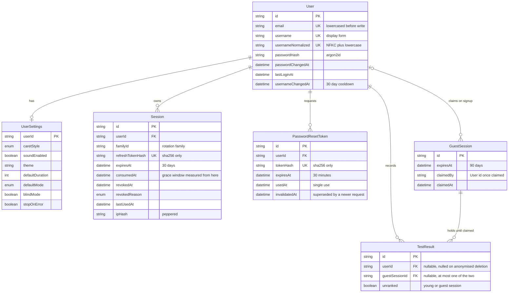
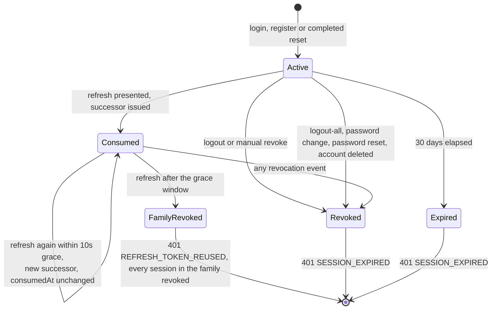
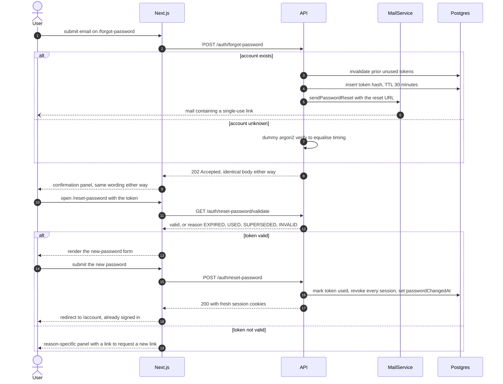
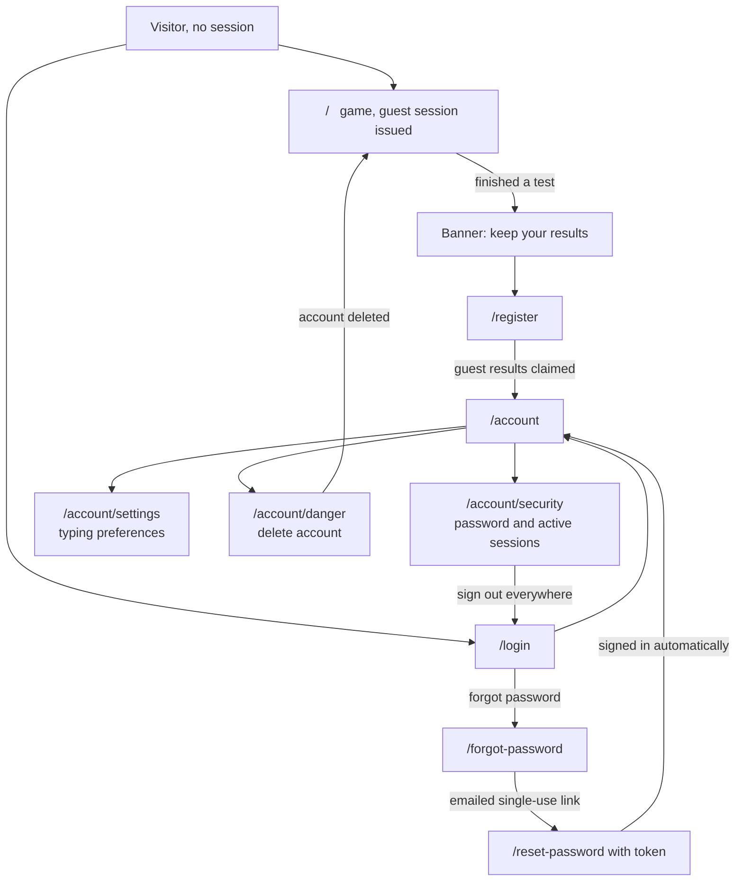
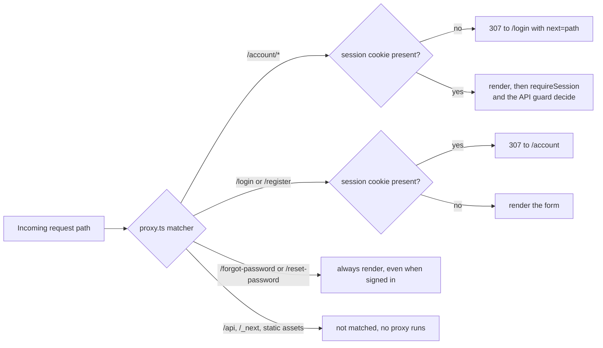

# 001 — Authentication & Users

| | |
| --- | --- |
| **Spec** | 001 |
| **Status** | Draft — decisions resolved 2026-09-10, awaiting approval to implement |
| **Owner** | Nicolas |
| **Last updated** | 2026-09-10 |
| **Depends on** | [002 — Database & Docker](002-database-and-docker.md) |

## 1. Summary

Identity for the typing game: account creation, credential login, password recovery, session
management via rotating JWTs, device session listing, and the user profile/settings that the typing
surface reads. Play is possible without an account — an anonymous guest accumulates results against
a device-scoped session, and those results are claimed into a real account on signup, so the funnel
from "tried it once" to "registered" loses no data.

> **On size.** This spec is deliberately larger than the ~600-line guideline in
> [spec/README.md](../README.md#directory-conventions). Registration, login, refresh, password reset
> and session revocation all mutate the same `Session` model and the same cookie pair; splitting
> them would put one state machine across four documents. Recorded here as the required reason.

## 2. Scope

**In scope**

- Email + password registration and login.
- Argon2id password hashing.
- Access tokens (JWT, 15 min) and refresh tokens (opaque, 30 days, rotating, one-time use with a
  10-second grace window).
- Two transports for the same session: `httpOnly` cookies (the web app, via the Next.js BFF) and
  `Authorization: Bearer` (future mobile/CLI clients).
- **Password reset** by emailed single-use token, including the provider-agnostic mail port it
  needs.
- Logout (single session), logout-all, and revoking one named session by id.
- Guest sessions and the claim-on-signup flow.
- User profile read/update, typing preferences, account deletion with optional result deletion.
- Username uniqueness, reservation and normalisation rules.
- The frontend pages, Server Actions and route protection for all of the above (§6).

**Out of scope** — each becomes its own spec

- OAuth / social login (Google, GitHub) → future spec 00X.
- **Email address verification.** Reset mail proves control of the address at recovery time; a
  separate verify-on-signup flow, with its unverified-account states, is its own feature.
- Changing one's email address (requires verification, therefore blocked on the above).
- Two-factor authentication.
- Roles, permissions, admin surfaces. Every authenticated user has identical authority in v1.
- Transactional email beyond password reset (welcome mail, notifications).
- The typing test lifecycle, passages, and result metrics themselves → future spec 003.
- Leaderboards → future spec 004.

## 3. User stories

### US-1 — Play without an account

*As a first-time visitor I want to take a typing test immediately so that I can judge the product
before committing to a signup.*

1. Visiting the game with no session issues a guest session and returns a `guestId`.
2. A result submitted with only a guest session persists and is returned to the client.
3. Guest results are visible in the current browser for the life of the guest cookie (90 days).
4. A guest session grants no access to `/users/me` or any account endpoint (401
   `AUTHENTICATION_REQUIRED`).

### US-2 — Register

*As a returning visitor I want to create an account so that my results and personal bests persist
across devices.*

1. Registering with a valid, unused email and username creates the user and returns a session.
2. Registration is rejected with 409 `EMAIL_ALREADY_REGISTERED` if the email exists
   (case-insensitive), or 409 `USERNAME_TAKEN` if the normalised username exists.
3. Passwords shorter than 10 characters are rejected with 400 `VALIDATION_FAILED`.
4. The response never contains `passwordHash` or any refresh-token material in the body.
5. If a `guestId` cookie is present at registration, every result attached to it is reassigned to
   the new user, and the guest session is closed.
6. Registration is rate-limited to 5 attempts per IP per hour (429 `RATE_LIMIT_EXCEEDED`).

### US-3 — Log in

*As a registered user I want to log in so that I regain access to my history.*

1. Correct credentials return 200 with an access token and set both session cookies.
2. Wrong password and unknown email both return 401 `INVALID_CREDENTIALS` with an identical
   body and comparable response time — the response must not reveal whether the email exists.
3. Login is rate-limited to 10 attempts per IP per 15 minutes and 5 per email per 15 minutes.
4. A successful login records `lastLoginAt` and creates a new session row.

### US-4 — Stay logged in

*As a logged-in user I want my session to survive a page reload and a closed browser so that I am
not asked to re-authenticate constantly.*

1. An expired access token plus a valid refresh token returns a new pair (200).
2. Refresh rotates: the presented refresh token is consumed and a new one is issued.
3. **Grace window (resolved: Q1 → yes).** A token already consumed **within the last 10 seconds**
   may rotate again and returns a fresh valid pair. Two tabs refreshing simultaneously therefore
   both succeed.
4. Reusing a token consumed **more than 10 seconds ago** revokes the entire session family and
   returns 401 `REFRESH_TOKEN_REUSED` — this is the detection signal for a stolen token.
5. The grace window is measured from the token's *first* use and is not extended by subsequent
   uses, so a token cannot be kept alive indefinitely by polling it every 9 seconds.
6. A refresh token older than 30 days, or belonging to a revoked session, returns 401
   `SESSION_EXPIRED`.

### US-5 — Log out, everywhere or on one device

*As a logged-in user I want to log out, to end sessions everywhere, and to kick one specific
device, so that I control access to my account.*

1. `POST /auth/logout` revokes the current session and clears both cookies. It returns 204 even
   when no session was present (idempotent).
2. `POST /auth/logout-all` revokes every session for the user; all other devices lose access on
   their next request.
3. **(resolved: Q5)** `GET /users/me/sessions` lists active sessions with the current one flagged,
   and `DELETE /users/me/sessions/:id` revokes one of them.
4. Revoking a session that is not the caller's own returns 404 `SESSION_NOT_FOUND` — never 403,
   which would confirm the id exists.
5. Revoking one's *own* current session behaves exactly like logout, cookies included.
6. A revoked session loses access **immediately**, not when its 15-minute access token expires
   (see §8, immediate revocation).

### US-6 — Recover a forgotten password

*As a user who has forgotten their password I want to reset it by email so that I do not lose my
account and its history.*

1. `POST /auth/forgot-password` with any syntactically valid email returns 202 with an identical
   body whether or not the account exists — no enumeration.
2. When the account exists, a mail is sent containing a single-use link valid for 30 minutes.
3. Requesting a second reset invalidates the first token, so only the newest link works.
4. `POST /auth/reset-password` with a valid token sets the new password, marks the token used, and
   **revokes every existing session** for that user.
5. After a successful reset the user is issued a fresh session and is logged in — having just
   proved control of the mailbox, a forced login adds friction without adding security.
6. An expired, unknown or already-used token returns 400 with a distinct `code` per case, so the
   page can say *"this link has expired"* rather than *"something went wrong"*.
7. Setting the new password equal to the current one returns 400 `PASSWORD_UNCHANGED`.
8. Reset requests are rate-limited to 3 per email per hour and 10 per IP per hour.
9. A mail-provider failure does not change the 202 response; it is logged at `error` for
   operators.

### US-7 — Profile & typing preferences

*As a logged-in user I want to set my display name and typing preferences so that the game behaves
the way I like on every device.*

1. `GET /users/me` returns the profile, settings, and aggregate stats.
2. `PATCH /users/me` accepts a partial update; omitted fields are untouched.
3. Changing the username enforces the same uniqueness and normalisation rules as registration,
   and is limited to once every 30 days (429 `USERNAME_CHANGE_TOO_SOON`).
4. Settings persist server-side and are delivered by the Server Component render, so the typing
   surface has the user's caret style and sound preference on first paint with no flash of
   defaults.
5. `PATCH /users/me/password` changes the password for a logged-in user, requiring the current
   password, and revokes all *other* sessions while keeping the caller's own.

### US-8 — Delete my account

*As a user I want to delete my account, and to choose whether my results go with it, so that I
control my data.*

1. `DELETE /users/me` requires the current password in the body (401 `INVALID_CREDENTIALS` if
   wrong) and the literal confirmation string `"DELETE"`.
2. Deletion removes the user, sessions, settings and any reset tokens, and revokes all access.
3. **(resolved: Q3)** By default results are **anonymised, not deleted**: `userId` is nulled and
   the row retained, so leaderboard integrity and aggregate statistics survive.
4. The deletion form carries a *"Also delete my results and leaderboard entries"* checkbox
   (`deleteResults`, default `false`). When true, every result belonging to the user is deleted
   and its leaderboard entries disappear.
5. Both behaviours are stated on the form before submission — the default is not a silent choice.

## 4. Data model

Prisma (confirmed: [spec 002 § 10](002-database-and-docker.md#10-decision-log), Q3).



`TestResult` appears here only in the shape spec 001 requires of it; its full definition belongs to
spec 003.

```prisma
model User {
  id                 String    @id @default(cuid(2))
  email              String    @unique                    // stored lowercased
  username           String    @unique                    // display form, as typed
  usernameNormalized String    @unique                    // lowercased, NFKC, for uniqueness
  passwordHash       String
  passwordChangedAt  DateTime?                            // surfaced on the sessions page
  lastLoginAt        DateTime?
  usernameChangedAt  DateTime?
  createdAt          DateTime  @default(now())
  updatedAt          DateTime  @updatedAt

  settings           UserSettings?
  sessions           Session[]
  resetTokens        PasswordResetToken[]
  results            TestResult[]

  @@index([createdAt])
}

model UserSettings {
  userId          String  @id
  user            User    @relation(fields: [userId], references: [id], onDelete: Cascade)

  caretStyle      CaretStyle @default(SMOOTH)
  soundEnabled    Boolean    @default(false)
  theme           String     @default("system")           // "system" | "light" | "dark"
  defaultDuration Int        @default(30)                 // seconds: 15 | 30 | 60 | 120
  defaultMode     TestMode   @default(TIME)
  language        String     @default("en")
  blindMode       Boolean    @default(false)              // hide correctness while typing
  stopOnError     Boolean    @default(false)

  updatedAt       DateTime   @updatedAt
}

model Session {
  id               String    @id @default(cuid(2))
  userId           String
  user             User      @relation(fields: [userId], references: [id], onDelete: Cascade)

  familyId         String                                  // rotation family; late reuse revokes all
  refreshTokenHash String    @unique                       // SHA-256 of the opaque token
  expiresAt        DateTime
  consumedAt       DateTime?                               // first rotation; grace measured from here
  revokedAt        DateTime?
  revokedReason    RevocationReason?
  createdAt        DateTime  @default(now())
  lastUsedAt       DateTime  @default(now())               // shown on the sessions page

  userAgent        String?
  ipHash           String?                                 // hashed with a pepper; never raw

  @@index([userId, revokedAt])
  @@index([familyId])
  @@index([expiresAt])                                     // supports the cleanup job
}

model PasswordResetToken {
  id            String    @id @default(cuid(2))
  userId        String
  user          User      @relation(fields: [userId], references: [id], onDelete: Cascade)

  tokenHash     String    @unique                           // SHA-256; plaintext exists only in the mail
  expiresAt     DateTime
  usedAt        DateTime?
  invalidatedAt DateTime?                                   // set when a newer token supersedes it
  createdAt     DateTime  @default(now())
  requestIpHash String?

  @@index([userId, usedAt])
  @@index([expiresAt])
}

model GuestSession {
  id        String   @id @default(cuid(2))
  createdAt DateTime @default(now())
  expiresAt DateTime                                        // createdAt + 90 days (resolved: Q2)
  claimedBy String?                                         // User.id once claimed
  claimedAt DateTime?

  results   TestResult[]

  @@index([expiresAt])
}

enum CaretStyle       { OFF BLOCK UNDERLINE SMOOTH }
enum TestMode         { TIME WORDS QUOTE }
enum RevocationReason { LOGOUT LOGOUT_ALL MANUAL_REVOKE REUSE_DETECTED PASSWORD_RESET PASSWORD_CHANGE ACCOUNT_DELETED EXPIRED_CLEANUP }
```

**Index rationale**

- `Session.expiresAt` — the nightly cleanup deletes expired sessions; without it that scan grows
  linearly with all sessions ever created.
- `Session.familyId` — late reuse detection revokes a whole family in one statement.
- `Session.userId, revokedAt` — the sessions page, logout-all and the immediate-revocation guard
  check all filter on this pair.
- `PasswordResetToken.userId, usedAt` — invalidating prior tokens on a new request is one indexed
  update.
- `User.usernameNormalized` — uniqueness must be enforced on the normalised form, so the unique
  index lives there rather than on the display form.

`TestResult` is defined in spec 003. This spec requires only that it carries a nullable `userId`
and a nullable `guestSessionId`, with a check constraint that at most one is set, and
`onDelete: Cascade` from `User` **not** set — deletion behaviour is chosen per request (US-8.3/8.4)
and therefore handled in application code, not by the database.

## 5. API contracts

Base path `/api/v1`. `Auth` column: **none** = public, **access** = valid access token,
**refresh** = valid refresh token.

| Method | Path | Auth | Purpose |
| --- | --- | --- | --- |
| POST | `/auth/register` | none | Create account, open session |
| POST | `/auth/login` | none | Open session |
| POST | `/auth/refresh` | refresh | Rotate session |
| POST | `/auth/logout` | access | Revoke current session |
| POST | `/auth/logout-all` | access | Revoke all sessions |
| POST | `/auth/guest` | none | Issue a guest session |
| POST | `/auth/forgot-password` | none | Send a reset link |
| GET | `/auth/reset-password/validate` | none | Pre-flight token check for the page |
| POST | `/auth/reset-password` | none | Consume token, set password, open session |
| GET | `/users/me` | access | Profile + settings + stats |
| PATCH | `/users/me` | access | Update profile |
| PATCH | `/users/me/password` | access | Change password |
| PATCH | `/users/me/settings` | access | Update typing preferences |
| GET | `/users/me/sessions` | access | List active sessions |
| DELETE | `/users/me/sessions/:id` | access | Revoke one session |
| DELETE | `/users/me` | access | Delete account |
| GET | `/users/username-available` | none | Pre-flight uniqueness check |

### POST `/auth/register`

```json
{
  "email": "nicolas@example.com",
  "username": "nico",
  "password": "correct horse battery",
  "acceptedTerms": true
}
```

| Field | Rule |
| --- | --- |
| `email` | required, valid email, ≤ 254 chars, lowercased before storage |
| `username` | required, 3–20 chars, `^[a-zA-Z0-9_]+$`, not in the reserved list |
| `password` | required, 10–128 chars, must not equal the email or username |
| `acceptedTerms` | required, must be `true` |

`201 Created`:

```json
{
  "user": {
    "id": "clx0f9a2b0000v3t5n7m1b0af",
    "email": "nicolas@example.com",
    "username": "nico",
    "createdAt": "2026-09-10T14:32:05.123Z"
  },
  "accessToken": "eyJhbGciOiJIUzI1NiIs...",
  "expiresIn": 900,
  "claimedResults": 3
}
```

Response headers (cookie transport):

```
Set-Cookie: tg_access=<jwt>; HttpOnly; Secure; SameSite=Lax; Path=/; Max-Age=900
Set-Cookie: tg_refresh=<opaque>; HttpOnly; Secure; SameSite=Strict; Path=/api/v1/auth; Max-Age=2592000
Set-Cookie: tg_guest=; Max-Age=0; Path=/
```

`tg_refresh` is path-scoped to the auth routes so it is not attached to every API call, and
`SameSite=Strict` because refresh is never a cross-site navigation. `Secure` is omitted only when
`NODE_ENV !== "production"`.

| Status | `code` | When |
| --- | --- | --- |
| 400 | `VALIDATION_FAILED` | Any schema rule violated; `details[]` lists offending paths |
| 409 | `EMAIL_ALREADY_REGISTERED` | Email exists (case-insensitive) |
| 409 | `USERNAME_TAKEN` | Normalised username exists, or is reserved |
| 429 | `RATE_LIMIT_EXCEEDED` | > 5 registrations per IP per hour |

### POST `/auth/login`

```json
{ "email": "nicolas@example.com", "password": "correct horse battery" }
```

`200 OK` — identical body to register, minus `claimedResults`. Same `Set-Cookie` headers.

| Status | `code` | When |
| --- | --- | --- |
| 400 | `VALIDATION_FAILED` | Missing field |
| 401 | `INVALID_CREDENTIALS` | Unknown email **or** wrong password |
| 429 | `RATE_LIMIT_EXCEEDED` | Per-IP or per-email limit hit |

### POST `/auth/refresh`

Token from the `tg_refresh` cookie, or `{ "refreshToken": "..." }` for Bearer clients. Empty body
otherwise.

`200 OK`:

```json
{ "accessToken": "eyJhbGciOiJIUzI1NiIs...", "expiresIn": 900 }
```

Sets a new `tg_access` and a **new** `tg_refresh`.

Decision procedure, in order:

1. Hash the presented token; look up the session. No match → 401 `REFRESH_TOKEN_INVALID`.
2. Session `revokedAt` set, or `expiresAt` passed → 401 `SESSION_EXPIRED`.
3. `consumedAt` set and `now - consumedAt <= REFRESH_GRACE_SECONDS` (10 s) → **rotate normally**,
   leaving `consumedAt` at its original value (US-4.3, US-4.5).
4. `consumedAt` set and older than the grace window → revoke the whole `familyId`
   (`revokedReason: REUSE_DETECTED`) → 401 `REFRESH_TOKEN_REUSED`.
5. Otherwise set `consumedAt = now`, create a successor session in the same family, return the new
   pair.



Two things the diagram makes visible and the prose above only implies: revocation is reachable from
`Consumed` as well as `Active`, and it is checked **before** reuse detection — which is why a
refresh after `logout-all` returns `SESSION_EXPIRED` rather than accusing the client of theft.

| Status | `code` | When |
| --- | --- | --- |
| 401 | `REFRESH_TOKEN_MISSING` | No cookie and no body token |
| 401 | `REFRESH_TOKEN_INVALID` | Hash matches no session |
| 401 | `REFRESH_TOKEN_REUSED` | Consumed beyond the grace window → family revoked |
| 401 | `SESSION_EXPIRED` | `expiresAt` passed or `revokedAt` set |

### POST `/auth/logout` · `/auth/logout-all`

`204 No Content`, with `Set-Cookie` clearing `tg_access` and `tg_refresh`. Both are idempotent;
`/auth/logout` returns 204 even with no valid session, so a client with a stale token can always
reach a clean state.

### POST `/auth/guest`

Empty body. `201 Created`:

```json
{ "guestId": "clx0g1h3c0001v3t5n7m1b0zz", "expiresAt": "2026-12-09T14:32:05.123Z" }
```

```
Set-Cookie: tg_guest=<guestId>; HttpOnly; Secure; SameSite=Lax; Path=/; Max-Age=7776000
```

If a valid `tg_guest` cookie is already present, the existing session is returned with 200 rather
than a new one being minted — otherwise a client that retries on network failure accumulates orphan
guest sessions. The 90-day lifetime is confirmed (Q2) and is treated as strictly necessary: the
guest id is never used for analytics, and it is disclosed in the privacy notice.

### POST `/auth/forgot-password`

```json
{ "email": "nicolas@example.com" }
```

`202 Accepted` — **always**, for any syntactically valid email:

```json
{ "message": "If an account exists for that address, a reset link is on its way." }
```

Behaviour when the account exists:

1. Any prior unused token for the user gets `invalidatedAt = now` (US-6.3).
2. A new token is minted: 32 random bytes, base64url; only its SHA-256 is stored; `expiresAt = now
   + 30 min`.
3. A mail is sent via `MailService` containing
   `${NEXT_PUBLIC_APP_URL}/reset-password?token=<plaintext>`.
4. A provider failure is logged at `error`; the response is still 202 (US-6.9).

When the account does not exist, the endpoint still performs a dummy Argon2 verify and returns 202
in a comparable time band, so response timing does not leak existence.

| Status | `code` | When |
| --- | --- | --- |
| 400 | `VALIDATION_FAILED` | Not a syntactically valid email |
| 429 | `RATE_LIMIT_EXCEEDED` | > 3 per email per hour, or > 10 per IP per hour |

### GET `/auth/reset-password/validate?token=<plaintext>`

Lets the page render *"this link has expired"* before the user types a new password.

`200 OK`:

```json
{ "valid": false, "reason": "EXPIRED" }
```

`reason` is `null` when `valid` is `true`, otherwise `"EXPIRED"`, `"USED"`, `"INVALID"` or
`"SUPERSEDED"`. Always 200, never 404 — the shape is the answer. Rate-limited to 20/h/IP. Checking a
token here does **not** consume it.



Note that `validate` never consumes the token: a mail client prefetching the link must not be able
to burn it before the user clicks.

### POST `/auth/reset-password`

```json
{ "token": "sYm9y...", "password": "a brand new passphrase" }
```

`200 OK` — same body and `Set-Cookie` headers as login (US-6.5). All prior sessions are revoked
with `revokedReason: PASSWORD_RESET` before the new one is created, and `passwordChangedAt` is set.

| Status | `code` | When |
| --- | --- | --- |
| 400 | `VALIDATION_FAILED` | Password rules violated |
| 400 | `RESET_TOKEN_INVALID` | Hash matches nothing |
| 400 | `RESET_TOKEN_EXPIRED` | Past `expiresAt` |
| 400 | `RESET_TOKEN_USED` | `usedAt` already set |
| 400 | `RESET_TOKEN_SUPERSEDED` | `invalidatedAt` set by a newer request |
| 400 | `PASSWORD_UNCHANGED` | New password verifies against the current hash (US-6.7) |
| 429 | `RATE_LIMIT_EXCEEDED` | > 10 attempts per IP per hour |

Distinct codes are intentional here: the token itself is the secret, and by the time it is
presented, telling its holder *why* it failed leaks nothing while removing a dead end from the UX.

### GET `/users/me`

`200 OK`:

```json
{
  "id": "clx0f9a2b0000v3t5n7m1b0af",
  "email": "nicolas@example.com",
  "username": "nico",
  "createdAt": "2026-09-10T14:32:05.123Z",
  "lastLoginAt": "2026-09-10T14:32:05.123Z",
  "passwordChangedAt": "2026-09-01T09:00:00.000Z",
  "settings": {
    "caretStyle": "SMOOTH",
    "soundEnabled": false,
    "theme": "system",
    "defaultDuration": 30,
    "defaultMode": "TIME",
    "language": "en",
    "blindMode": false,
    "stopOnError": false
  },
  "stats": {
    "testsCompleted": 42,
    "bestWpm": 96,
    "averageWpm": 78.4,
    "averageAccuracy": 0.961
  }
}
```

`stats` is computed by the results module (spec 003); this endpoint composes it. Errors: 401
`AUTHENTICATION_REQUIRED`, 401 `ACCESS_TOKEN_EXPIRED` (distinct code so the client refreshes rather
than redirecting to login).

### PATCH `/users/me`

```json
{ "username": "nicolas" }
```

`200 OK` with the same body as `GET /users/me`.

| Status | `code` | When |
| --- | --- | --- |
| 400 | `VALIDATION_FAILED` | Username rules violated; empty body |
| 409 | `USERNAME_TAKEN` | Taken or reserved |
| 429 | `USERNAME_CHANGE_TOO_SOON` | Changed within the last 30 days; `details` carries `retryAfter` |

### PATCH `/users/me/password`

```json
{ "currentPassword": "correct horse battery", "newPassword": "a brand new passphrase" }
```

`204 No Content`. Revokes every session **except** the caller's own
(`revokedReason: PASSWORD_CHANGE`) and sets `passwordChangedAt`. Errors: 400 `VALIDATION_FAILED`,
400 `PASSWORD_UNCHANGED`, 401 `INVALID_CREDENTIALS`.

### PATCH `/users/me/settings`

Any subset of the `settings` object. Unknown keys are a 400 (`forbidNonWhitelisted`), not a silent
drop — a typo'd preference key must be loud. `200 OK` returns the full settings object.

### GET `/users/me/sessions`

`200 OK`:

```json
{
  "data": [
    {
      "id": "clx0h2i4d0002v3t5n7m1b0qq",
      "current": true,
      "userAgent": "Mozilla/5.0 (Macintosh; Intel Mac OS X 10_15_7)…",
      "createdAt": "2026-09-10T14:32:05.123Z",
      "lastUsedAt": "2026-09-10T15:02:41.000Z",
      "expiresAt": "2026-10-10T14:32:05.123Z"
    }
  ],
  "pageInfo": { "nextCursor": null, "hasNextPage": false }
}
```

Lists only sessions with `revokedAt IS NULL AND expiresAt > now()`. Never returns token material or
raw IPs. Ordered `current` first, then `lastUsedAt` descending.

### DELETE `/users/me/sessions/:id`

`204 No Content`, `revokedReason: MANUAL_REVOKE`. If `:id` is the caller's own session, both cookies
are cleared in the response (US-5.5).

| Status | `code` | When |
| --- | --- | --- |
| 404 | `SESSION_NOT_FOUND` | Unknown id, another user's id, or already revoked (US-5.4) |

### DELETE `/users/me`

```json
{ "password": "correct horse battery", "confirm": "DELETE", "deleteResults": false }
```

`204 No Content`, cookies cleared. `deleteResults` defaults to `false` → results anonymised
(`userId = null`, row retained). When `true`, all of the user's results and leaderboard entries are
deleted. The whole operation runs in one transaction.

| Status | `code` | When |
| --- | --- | --- |
| 400 | `VALIDATION_FAILED` | `confirm` ≠ `"DELETE"`; `deleteResults` not a boolean |
| 401 | `INVALID_CREDENTIALS` | Wrong password |

### GET `/users/username-available?username=nico`

`200 OK` → `{ "available": false, "reason": "TAKEN" }` where `reason` is `null`, `"TAKEN"`,
`"RESERVED"` or `"INVALID_FORMAT"`. Rate-limited to 30/min per IP so it cannot be used to enumerate
the user list.

### Mail port

`MailService` is an interface with one method per template, injected by driver:

```
sendPasswordReset(to: string, resetUrl: string, expiresInMinutes: number): Promise<void>
```

| Driver | `MAIL_DRIVER` | Used in |
| --- | --- | --- |
| SMTP (nodemailer) | `smtp` | Local development → Mailpit at `localhost:1025`, UI on `:8025` |
| Resend | `resend` | Production |
| No-op recorder | `memory` | Tests — records calls in an array, asserts the reset URL |

Send timeout 5 s. Failures throw internally, are caught by the auth service, logged with the
`requestId`, and never alter the 202. Only the plaintext token appears in the mail; it is never
logged, in any environment.

## 6. Frontend pages & routes

`apps/web`, Next.js App Router. Server Components by default; `"use client"` only where noted.
No page calls NestJS directly — everything goes through a Server Action or a server-side fetcher
(see [ARCHITECTURE.md § 4](../../ARCHITECTURE.md#4-frontend-architecture-nextjs-app-router)).

### Route map

| Route | Group | Auth | Rendering | Purpose |
| --- | --- | --- | --- | --- |
| `/` | `(game)` | public, guest session issued | RSC shell + client typing surface | Play. Owned by spec 003; this spec owns only its auth-related banners |
| `/login` | `(auth)` | public, redirect if authed | RSC + client form | Credential login |
| `/register` | `(auth)` | public, redirect if authed | RSC + client form | Signup, guest-claim notice |
| `/forgot-password` | `(auth)` | public | RSC + client form | Request a reset link |
| `/reset-password` | `(auth)` | public + `?token` | RSC validates the token, client form | Set a new password |
| `/account` | `(account)` | required | RSC | Profile, stats, username change |
| `/account/security` | `(account)` | required | RSC + client forms | Password change, active sessions |
| `/account/settings` | `(account)` | required | RSC + client form | Typing preferences |
| `/account/danger` | `(account)` | required | RSC + client form | Delete account |



Redirect and guard rules, as enforced by `proxy.ts`:



The proxy only ever reads cookie *presence*. It runs on every prefetch, so a database or API call
here would put the whole app behind an auth round-trip; the authoritative checks sit behind it.

### Layouts

| File | Responsibility |
| --- | --- |
| `app/(auth)/layout.tsx` | Centred narrow card. Reads the session server-side and `redirect("/")` if already authenticated, so a logged-in user cannot see the login form |
| `app/(account)/layout.tsx` | Calls `requireSession()` (redirects to `/login?next=<path>` when absent), fetches `GET /users/me` **once**, renders the account nav, and passes the profile down. Child pages do not re-fetch |
| `app/layout.tsx` | Header with the auth state: username + logout for authenticated users, "Log in / Sign up" otherwise |

### `/login`

- **Data:** none server-side.
- **Client component:** `features/auth/login-form.tsx` — email, password, "Forgot password?" link to
  `/forgot-password`, submit.
- **Server Action:** `loginAction`.
- **Validation:** the shared zod schema from `packages/contracts`, client-side for instant feedback
  and again in the action — client validation is UX, never the enforcement point.
- **On success:** cookies set by the action, then `redirect(next ?? "/account")`.
- **Error mapping:** `INVALID_CREDENTIALS` → one form-level message, *"Email or password is
  incorrect."* placed on the form, not per-field, so the UI does not disclose which half was wrong.
  `RATE_LIMIT_EXCEEDED` → *"Too many attempts. Try again in N minutes."*
- **`?next=` handling:** accepted only when it starts with a single `/` and is not `//`; anything
  else is discarded and the user goes to `/account`. Without this the parameter is an open redirect.
- **States:** idle · submitting (button disabled, spinner, inputs read-only) · error.
- **a11y:** the form error is in `role="alert"`, focus moves to it on failure; inputs carry
  `autoComplete="email"` / `"current-password"`.

```
┌──────────────────────────────┐
│         Log in               │
│  Email    [______________]   │
│  Password [______________]   │
│                Forgot? →     │
│  [        Log in         ]   │
│  New here? Create an account │
└──────────────────────────────┘
```

### `/register`

- **Server-side:** reads the `tg_guest` cookie and, if present, fetches the guest result count to
  render *"You have 3 unsaved results — creating an account keeps them."* (US-2.5 made visible).
- **Client component:** `features/auth/register-form.tsx` — email, username, password,
  `acceptedTerms` checkbox.
- **Username availability:** debounced 400 ms call to `/users/username-available` through a BFF
  route handler, showing available / taken / reserved inline. Advisory only; the authoritative check
  is the 409 on submit.
- **Password field:** live rule checklist (length, not equal to email/username). No strength meter —
  it implies precision the rules do not have.
- **Server Action:** `registerAction`.
- **On success:** `redirect("/account")`, and if `claimedResults > 0` a toast: *"3 results added to
  your account."*
- **Error mapping:** `EMAIL_ALREADY_REGISTERED` → on the email field, with a link to `/login`
  prefilled via `?email=`. `USERNAME_TAKEN` → on the username field.

### `/forgot-password`

- **Client component:** `features/auth/forgot-password-form.tsx` — email only.
- **Server Action:** `forgotPasswordAction`.
- **On success:** the form is replaced by a confirmation panel — *"If an account exists for that
  address, a reset link is on its way. The link expires in 30 minutes."* The wording is identical
  whether or not the account exists (US-6.1), and the UI must never branch on existence.
- **Resend:** a resend button appears after 60 seconds, subject to the same server-side limit; on
  429 it shows *"Please wait before requesting another link."*

### `/reset-password`

- **Server-side:** reads `?token`, calls `GET /auth/reset-password/validate`, and branches **before**
  rendering a form:
  - no `token` param → *"This link is incomplete"* + link to `/forgot-password`;
  - `valid: false` → a reason-specific panel (`EXPIRED` / `USED` / `SUPERSEDED` / `INVALID`), each
    offering "Request a new link";
  - `valid: true` → the form.
- **Client component:** `features/auth/reset-password-form.tsx` — new password, confirm password
  (matched client-side only; the API takes one field).
- **Server Action:** `resetPasswordAction`.
- **On success:** logged in (US-6.5) → `redirect("/account")` with a toast *"Password updated. You
  were signed out on all other devices."*
- **Error mapping:** the token can expire between page load and submit, so the action's
  `RESET_TOKEN_*` errors render the same reason panels rather than a form error.
- **Security:** the token stays in the URL and is never written to `localStorage` or a client-side
  log; the page sets `robots: noindex` metadata.

### `/account`

- **Data:** the profile from the layout — no fetch of its own.
- **Sections:** identity (username with an inline edit, email read-only with a *"changing your email
  isn't available yet"* note, member since), stats summary (tests, best WPM, average WPM, accuracy),
  a link to full history (spec 003).
- **Client component:** `features/account/username-form.tsx`.
- **Server Action:** `updateProfileAction`, then `revalidatePath("/account")`.
- **Error mapping:** `USERNAME_CHANGE_TOO_SOON` → *"You can change your username again on
  {date}."*, computed from `details.retryAfter`.
- **Empty state:** zero tests → *"No tests yet"* with a link to `/`, not a zeroed stats grid.

### `/account/security`

Two independent panels on one page, because both concern credentials and both revoke sessions.

1. **Change password** — `features/account/password-form.tsx`, current + new password,
   `changePasswordAction`. On success: *"Password updated. Other devices were signed out."* Errors:
   `INVALID_CREDENTIALS` on the current-password field, `PASSWORD_UNCHANGED` on the new one.
2. **Active sessions** — RSC list from `GET /users/me/sessions`, each row showing a device
   description parsed from the user agent, `lastUsedAt` as relative time, and *"This device"* on the
   current one. Each non-current row has a **Revoke** button (`revokeSessionAction`, then
   `revalidatePath`). Revoking the current row is not offered — the header's Log out does that.
   A **Sign out everywhere** button (`logoutAllAction`) sits below, behind a confirm dialog, and
   redirects to `/login`.
   - **Error mapping:** `SESSION_NOT_FOUND` (the row was already gone) → refresh the list silently
     rather than showing an error; the user's intent was satisfied either way.
   - `passwordChangedAt` is displayed above the list for context.

### `/account/settings`

- **Data:** `settings` from the layout's profile.
- **Client component:** `features/account/settings-form.tsx` — caret style (radio, with a live
  preview of the caret), sound toggle, theme (system/light/dark), default duration (15/30/60/120),
  default mode, language, blind mode, stop-on-error.
- **Server Action:** `updateSettingsAction`, per-field on change, debounced 500 ms, with an optimistic
  update via `useOptimistic` and a revert plus toast on failure. Optimistic is appropriate here:
  these writes are small, idempotent, and a stale toggle is a visible lie.
- **Guests:** the page is auth-only; a guest reaching it is redirected to `/login?next=/account/settings`.
  Guest preferences live in `localStorage` and are not synced (spec 003 owns that).

### `/account/danger`

- **Client component:** `features/account/delete-account-form.tsx`.
- **Fields:** current password, a checkbox *"Also delete my results and leaderboard entries"*
  (`deleteResults`, unchecked by default), and a text input requiring the literal `DELETE`.
- **Copy, stated before submission (US-8.5):**
  - unchecked → *"Your account is deleted. Your past results are kept without your name attached, so
    leaderboards stay accurate."*
  - checked → *"Your account and every result you have recorded are deleted permanently. This cannot
    be undone."*
- **Server Action:** `deleteAccountAction` → on success clears cookies and `redirect("/?deleted=1")`,
  where the game page shows a single confirmation toast.
- **Submit** is disabled until the confirmation text matches exactly and a password is present.

### Server Actions

All in `app/(auth)/actions.ts` and `app/(account)/actions.ts`, all `"use server"`, all returning a
discriminated union `{ ok: true, … } | { ok: false, code: string, details?: … }` so the client never
sees a thrown error boundary for an expected 4xx.

| Action | Calls | On success |
| --- | --- | --- |
| `loginAction` | `POST /auth/login` | Set cookies, redirect |
| `registerAction` | `POST /auth/register` | Set cookies, clear guest cookie, redirect |
| `forgotPasswordAction` | `POST /auth/forgot-password` | Render the confirmation panel |
| `resetPasswordAction` | `POST /auth/reset-password` | Set cookies, redirect |
| `logoutAction` | `POST /auth/logout` | Clear cookies, `revalidatePath("/", "layout")`, redirect |
| `logoutAllAction` | `POST /auth/logout-all` | Clear cookies, redirect to `/login` |
| `revokeSessionAction` | `DELETE /users/me/sessions/:id` | `revalidatePath("/account/security")` |
| `updateProfileAction` | `PATCH /users/me` | `revalidatePath("/account")` |
| `changePasswordAction` | `PATCH /users/me/password` | Toast; keep the session |
| `updateSettingsAction` | `PATCH /users/me/settings` | `revalidatePath("/account/settings")` |
| `deleteAccountAction` | `DELETE /users/me` | Clear cookies, redirect |

Cookies are re-issued by the action from the API's `Set-Cookie` headers, rewritten onto the web
origin via `cookies().set()` — the API's domain and the web app's domain are not necessarily the
same, so the header is translated rather than forwarded verbatim.

### Session helpers — `lib/session.ts` (server-only)

| Function | Behaviour |
| --- | --- |
| `getSession()` | Returns `{ user } \| null`. Reads `tg_access`, calls `GET /users/me`; on `ACCESS_TOKEN_EXPIRED` attempts one refresh, then retries once |
| `requireSession()` | `getSession()` or `redirect("/login?next=<current path>")` |
| `apiFetch()` | Adds the base URL, the cookie header, `requestId`, and a 5 s timeout; parses the error envelope into the action's union type |

`getSession()` is wrapped in React `cache()` so one render never issues two `/users/me` calls.

### Route protection — `proxy.ts`

Optimistic only: presence and structural validity of `tg_access` or `tg_refresh`. No API call, no
database read — this runs on every prefetch, and the authoritative check is the NestJS guard plus
`requireSession()`.

| Matcher | Rule |
| --- | --- |
| `/account/:path*` | No session cookie → 307 to `/login?next=<pathname>` |
| `/login`, `/register` | Session cookie present → 307 to `/account` |
| `/forgot-password`, `/reset-password` | Never redirected — a logged-in user resetting a password on a shared device is legitimate |
| `/api`, `/_next/*`, static assets | Excluded from the matcher entirely |

### Web-side non-functional requirements

- No auth page ships a client bundle larger than 40 KB gzipped beyond the shared framework chunk.
- All forms work with JavaScript disabled: Server Actions are invoked through a real `<form action>`,
  and client validation is purely additive.
- `/login`, `/register`, `/forgot-password` are statically rendered; `/reset-password` and every
  `(account)` route are dynamic (`export const dynamic = "force-dynamic"`) and never cached.
- Every account route sets `robots: noindex`.
- Focus management: on navigation the page `<h1>` receives focus; on form error the alert does.
- Errors are conveyed by text and icon, never colour alone.

## 7. Edge cases & error handling

| Condition | Expected behaviour |
| --- | --- |
| Email differing only in case (`Nico@x.com` vs `nico@x.com`) | Same account. Lowercased before write and before lookup |
| Email with a leading/trailing space | Trimmed before validation |
| Username differing only in case or by Unicode confusables | Rejected as taken. Uniqueness is on `usernameNormalized` (NFKC + lowercase) |
| Reserved usernames (`admin`, `root`, `api`, `me`, `settings`, `login`, `logout`, `register`, `null`, `undefined`, `support`, `moderator`, `anonymous`, `guest`) | 409 `USERNAME_TAKEN` with `reason: "RESERVED"` |
| Two concurrent registrations, same email | One 201, one 409. Enforced by the DB unique index, not a read-then-write check; Prisma `P2002` maps to `ConflictException` |
| Two tabs refreshing at the same moment | Both succeed via the 10 s grace window (US-4.3). Each gets its own successor session in the family |
| A token polled every 9 s to stay alive | Fails on the second attempt outside the window: grace runs from `consumedAt`, which is never updated by a grace rotation (US-4.5) |
| A stolen token used inside the grace window | Succeeds. Accepted cost of Q1: the window is 10 s and detection resumes immediately after it |
| Refresh after `logout-all` on another device | 401 `SESSION_EXPIRED`, not `REFRESH_TOKEN_REUSED` — revocation is checked before consumption (step 2 before step 3) |
| Password exactly 10 / 128 / 129 chars | Accept, accept, reject |
| Password equal to email or username | 400 `VALIDATION_FAILED` |
| Very long password (DoS via Argon2 cost) | Length capped at 128 **before** hashing |
| Login against a deleted account | 401 `INVALID_CREDENTIALS` — never "account deleted" |
| Reset requested for a non-existent email | 202, no mail, dummy verify performed to equalise timing |
| Reset requested twice | Only the newest link works; the older returns `RESET_TOKEN_SUPERSEDED` |
| Reset link opened twice (mail client prefetch, then the user) | `validate` does not consume, so a prefetching client cannot burn the link. Only `POST /auth/reset-password` sets `usedAt` |
| Reset link used after the password already changed by other means | Token still valid until expiry unless superseded. Accepted: the token proves mailbox control, which has not changed |
| Reset completed while another device holds a valid access token | That device loses access within one request — the guard checks `revokedAt` (see §8) |
| Reset token in a mail forwarded to a third party | Single-use, 30 min. Documented in the mail body: *"If you didn't request this, ignore it."* |
| Mail provider down | 202 to the client, `error` log with the `requestId`, no retry queue in v1 (§11 Q2) |
| Revoking a session id that is already revoked | 404 `SESSION_NOT_FOUND`; the UI silently refreshes the list |
| Revoking another user's session id | 404, identical body — existence is never confirmed |
| Sessions page open while another device logs out | Stale rows. Revoking one returns 404 → list re-fetched. No polling |
| Access token valid but its session revoked | 401 `AUTHENTICATION_REQUIRED`. The guard resolves user **and** session in one query |
| Access token signed with a rotated secret | 401 `ACCESS_TOKEN_INVALID` |
| Access token with a valid signature but a `sub` that no longer exists | 401 `AUTHENTICATION_REQUIRED` |
| Clock skew on `exp` | 30-second `clockTolerance` on verification |
| Guest cookie present but the row is expired or deleted | Treated as absent; a fresh guest session is issued |
| Registration with a `guestId` that was already claimed | Registration succeeds, `claimedResults: 0`, no error. Claiming is idempotent |
| Guest results claimed while a submission is in flight | Claim runs in a transaction; a result written after the claim stays on the guest session and is never picked up. Accepted loss of at most one result, documented rather than solved |
| Cookie and `Authorization` header both present with different sessions | Header wins; the discrepancy is logged at `warn` |
| Missing `User-Agent` | Session created with `userAgent: null`; the sessions page shows *"Unknown device"* |
| Account deleted with `deleteResults: false` | Results keep their rows with `userId = null`; leaderboard entries show *"deleted user"* |
| Account deleted with `deleteResults: true` | Results and leaderboard entries deleted in the same transaction as the user |
| Account deletion racing a result submission | Transaction ordering decides. A result written after deletion has a `userId` that no longer exists → the FK rejects it, surfacing as 401 on the submitting client |
| `?next=` set to `https://evil.example` or `//evil.example` | Discarded; redirect goes to `/account` |
| PATCH with an empty object | 400 `VALIDATION_FAILED` — no-op writes are a client bug worth surfacing |

### Anti-cheat touchpoints

Owned by spec 003, but auth carries two obligations:

1. **Result attribution is server-derived.** `userId` on a result comes from the access token, never
   from the request body. A body-supplied `userId` is a 400 (`forbidNonWhitelisted`).
2. **Session age gates the leaderboard.** Results from a session younger than 60 seconds, or from a
   guest session, are persisted but flagged `unranked: true` so a scripted client cannot mint fresh
   sessions to farm leaderboard entries.

## 8. Non-functional requirements

| Requirement | Target |
| --- | --- |
| Password hashing | Argon2id, `memoryCost` 19 MiB, `timeCost` 2, `parallelism` 1 (OWASP 2024 baseline). Never bcrypt |
| Hash verification time | 50–150 ms. Login and forgot-password both run a dummy verify on unknown emails so timing does not distinguish them |
| Access token | HS256, 15 min TTL, claims `sub`, `sid`, `iat`, `exp`, `iss: "typing-game"`. No email or username in the payload |
| Refresh token | 32 random bytes, base64url. Stored as SHA-256 only — a database dump must not yield usable tokens |
| Refresh grace window | `REFRESH_GRACE_SECONDS`, default 10, max 60. Configurable so it can be tightened without a deploy of new logic |
| Reset token | 32 random bytes, base64url, SHA-256 at rest, 30 min TTL, single use, superseded by any newer request |
| Immediate revocation | The `JwtAuthGuard` resolves user + session in **one** indexed query per request and rejects when `revokedAt IS NOT NULL`. This closes the up-to-15-minute window a stateless guard would leave open, at the cost of one query per authenticated request — measured against the `/users/me` budget below |
| Secrets | `JWT_ACCESS_SECRET` ≥ 32 bytes, from env, validated at boot (spec 002 § env contract) |
| `p95` latency | `/auth/login` ≤ 250 ms · `/users/me` ≤ 60 ms · `/auth/refresh` ≤ 80 ms · `/auth/forgot-password` ≤ 400 ms including the mail call |
| Rate limits | register 5/h/IP · login 10/15min/IP and 5/15min/email · refresh 60/h/session · forgot-password 3/h/email and 10/h/IP · reset-password 10/h/IP · validate 20/h/IP · username-available 30/min/IP |
| **Known limitation** | Rate-limit state is in-process (`@nestjs/throttler` memory store; no Redis, per [spec 002 § 10](002-database-and-docker.md#10-decision-log) Q5). Every limit above is therefore **per API instance** and must be revisited before horizontal scaling |
| Session cleanup | Nightly job deletes sessions where `expiresAt < now() - 7 days`, guest sessions past `expiresAt`, and reset tokens past `expiresAt` |
| Logging | Never log passwords, tokens, token hashes, or reset URLs. IPs are hashed with `IP_HASH_PEPPER` before storage |
| Enumeration | No endpoint distinguishes "exists" from "wrong credentials", except `username-available`, which is rate-limited by design |
| Mail | 5 s send timeout, no retry in v1. Failure never changes a response status |

## 9. Test plan

Written and human-approved **before** any implementation (see
[spec/README.md § the development cycle](../README.md#the-development-cycle)).

### Backend — Jest + Supertest, real Postgres (`test` profile)

`apps/api/test/auth.e2e-spec.ts`

| Test | Asserts |
| --- | --- |
| registers a new user | 201, body shape, no `passwordHash`, both cookies with `HttpOnly` + correct `SameSite` + `Path` (US-2.1, US-2.4) |
| rejects a duplicate email case-insensitively | 409 `EMAIL_ALREADY_REGISTERED` (US-2.2) |
| rejects a reserved username | 409 `USERNAME_TAKEN`, `reason: "RESERVED"` |
| rejects a short password | 400, `details[0].path === "password"` (US-2.3) |
| claims guest results on registration | `claimedResults === 3`, results now carry `userId`, guest cookie cleared (US-2.5) |
| logs in with correct credentials | 200, `lastLoginAt` updated, new session row (US-3.1, US-3.4) |
| returns the same error for unknown email and wrong password | identical body and `code`; both within the same timing band (US-3.2) |
| rotates on refresh | new access **and** new refresh token; old `consumedAt` set (US-4.1, US-4.2) |
| allows a second rotation inside the grace window | two sequential refreshes with the *same* token both 200; `consumedAt` unchanged after the second (US-4.3, US-4.5) |
| revokes the family on reuse after the grace window | with the clock advanced past 10 s: 401 `REFRESH_TOKEN_REUSED`, every session in the family `revokedAt` set, `revokedReason: REUSE_DETECTED` (US-4.4) |
| prefers revocation over reuse detection | logout-all then refresh → 401 `SESSION_EXPIRED`, not `REFRESH_TOKEN_REUSED` |
| rejects an expired session | 401 `SESSION_EXPIRED` (US-4.6) |
| logout is idempotent | 204 with a session, 204 without (US-5.1) |
| logout-all kills other devices | second client's next request → 401 (US-5.2) |
| enforces the login rate limit | 11th attempt → 429 `RATE_LIMIT_EXCEEDED` (US-3.3) |
| guard rejects a token whose session was revoked | 401 `AUTHENTICATION_REQUIRED` on the *next* request, without waiting for expiry (US-5.6) |
| guard rejects a token for a deleted user | 401 `AUTHENTICATION_REQUIRED` |
| concurrent duplicate registrations | exactly one 201, one 409 |

`apps/api/test/password-reset.e2e-spec.ts`

| Test | Asserts |
| --- | --- |
| returns 202 for a known email and sends one mail | memory driver recorded once; URL contains a token (US-6.2) |
| returns an identical 202 for an unknown email | same status and body, no mail recorded (US-6.1) |
| supersedes a prior token | first token → 400 `RESET_TOKEN_SUPERSEDED`; second works (US-6.3) |
| resets the password and revokes all sessions | 200, new cookies, every prior session `revokedReason: PASSWORD_RESET`, old refresh → 401 (US-6.4, US-6.5) |
| `validate` does not consume the token | validate twice, then reset → still succeeds |
| rejects an expired token | clock past 30 min → 400 `RESET_TOKEN_EXPIRED` (US-6.6) |
| rejects a used token | second POST → 400 `RESET_TOKEN_USED` |
| rejects an unchanged password | 400 `PASSWORD_UNCHANGED` (US-6.7) |
| enforces the per-email limit | 4th request in an hour → 429 (US-6.8) |
| survives a mail failure | driver throws → still 202, one `error` log (US-6.9) |
| never logs the token | log spy contains no substring of the plaintext token |

`apps/api/test/users.e2e-spec.ts`

| Test | Asserts |
| --- | --- |
| returns profile, settings and stats | 200, full shape (US-7.1) |
| patches partially | omitted fields unchanged (US-7.2) |
| enforces the username cooldown | 429 `USERNAME_CHANGE_TOO_SOON` with `retryAfter` (US-7.3) |
| rejects unknown settings keys | 400 `VALIDATION_FAILED` |
| changes the password | 204, other sessions revoked, caller's session still valid (US-7.5) |
| lists sessions with the current one flagged | `current: true` on exactly one row; no token material in the payload (US-5.3) |
| revokes one session by id | 204; that device's next request 401; others unaffected (US-5.3) |
| returns 404 for another user's session id | 404 `SESSION_NOT_FOUND`, body identical to the unknown-id case (US-5.4) |
| revoking one's own session clears cookies | `Set-Cookie` with `Max-Age=0` for both (US-5.5) |
| deletes with the correct password, results anonymised | 204, user gone, results retained with `userId === null` (US-8.1–8.3) |
| deletes with `deleteResults: true` | results and leaderboard entries gone (US-8.4) |
| rejects deletion with a wrong password | 401 `INVALID_CREDENTIALS` |
| rejects deletion without `confirm: "DELETE"` | 400 `VALIDATION_FAILED` |
| guest cannot reach `/users/me` | 401 `AUTHENTICATION_REQUIRED` (US-1.4) |

Unit suites: `AuthService` rotation logic against a mocked `PrismaService`, driven by a fake clock —
the grace-window branch is the single most delicate piece of logic in this spec and gets exhaustive
table coverage; username normalisation table tests (case, Unicode confusables, NFKC, reserved list);
`packages/contracts` zod schemas at boundary values.

### Frontend — Vitest + React Testing Library, API mocked with MSW

| File | Asserts |
| --- | --- |
| `features/auth/login-form.test.tsx` | Client zod validation; submit disabled while pending; `INVALID_CREDENTIALS` renders one form-level message and never a per-field one; focus moves to the alert |
| `features/auth/register-form.test.tsx` | Password rule checklist updates live; `acceptedTerms` gates submit; 409s map to the right fields; guest banner renders only with a guest cookie |
| `features/auth/forgot-password-form.test.tsx` | Confirmation panel is byte-identical for known and unknown emails; resend appears after 60 s; 429 renders the wait message |
| `features/auth/reset-password-page.test.tsx` | Each `validate` reason renders its own panel; no form is rendered for an invalid token; a token expiring between load and submit re-renders the reason panel |
| `features/account/sessions-list.test.tsx` | Current row is labelled and has no revoke button; revoke removes the row; a 404 refreshes the list without an error toast |
| `features/account/delete-account-form.test.tsx` | Copy changes with the checkbox; submit disabled until `DELETE` matches exactly; `deleteResults` is sent as a boolean |
| `features/account/settings-form.test.tsx` | Optimistic toggle applies immediately and reverts with a toast on failure; debounce coalesces rapid changes into one call |
| `lib/session.test.ts` | `getSession()` refreshes once on `ACCESS_TOKEN_EXPIRED` then retries; returns null after a failed refresh; `requireSession()` redirects with the `next` param; `cache()` dedupes within a render |
| `proxy.test.ts` | `/account/*` without a cookie → redirect with `next`; `/login` with a cookie → `/account`; `/reset-password` never redirected; assets unmatched |
| `app/(auth)/actions.test.ts` | `?next=//evil.example` and absolute URLs are discarded; cookies are rewritten onto the web origin; the error envelope maps to the discriminated union |

## 10. Decision log

| # | Question | Resolution (2026-09-10) |
| --- | --- | --- |
| Q1 | Refresh-rotation grace window? | **Yes, 10 s.** Implemented as "a consumed token may rotate again within 10 s of its first use", not as "re-return the previous replacement" — the latter would require storing refresh-token plaintext. Same UX, nothing extra at rest. `consumedAt` is never updated by a grace rotation, so the window cannot be extended. See US-4.3–4.5 |
| Q2 | Guest cookie lifetime? | **Keep 90 days.** Treated as strictly necessary, never used for analytics, disclosed in the privacy notice |
| Q3 | Delete or anonymise results on account deletion? | **Anonymise by default, with an opt-in "delete my results too" checkbox** on the deletion form (`deleteResults`, default `false`). Both outcomes are stated in the UI before submission. See US-8.3–8.5 |
| Q4 | Ship credentials without password reset? | **No — password reset is in scope.** This pulls in an outbound-mail dependency, handled as a `MailService` port with three drivers (SMTP/Mailpit locally, Resend in production, memory in tests). Email *verification* stays out of scope: reset mail proves mailbox control at recovery time, which is what the account-loss risk required |
| Q5 | Allow revoking a single session? | **Yes.** `GET /users/me/sessions` + `DELETE /users/me/sessions/:id`, surfaced on `/account/security`. Unknown or foreign ids return 404, never 403 |

## 11. Open questions

| # | Question | Why it matters | Proposal |
| --- | --- | --- | --- |
| Q1 | Which production mail provider — Resend, Postmark, or SES? | Only the driver changes, but the sending domain, DKIM/SPF records and deliverability work are real setup, and reset mail landing in spam is indistinguishable from a broken feature | Resend for developer experience; the `MailService` port makes the choice reversible in an afternoon. Needs a decision before the first deploy, not before implementation |
| Q2 | Retry failed reset mails? | A transient provider blip silently costs a user their recovery path, and they see a success message | Not in v1 (no queue infrastructure). Mitigation: the resend button on `/forgot-password`. Revisit if provider errors show up in logs |
| Q3 | Should `passwordChangedAt` force a re-login for sessions older than it? | Belt-and-braces against a session created between compromise and reset | Unnecessary — reset already revokes every session explicitly. Recorded so the question is not re-asked |
